# 🏗️ NeuralLog System Architecture

This document provides a comprehensive overview of the NeuralLog platform architecture, including system design, component interactions, data flow, and technical decisions.

## 📋 Table of Contents

- [🎯 Architecture Overview](#-architecture-overview)
- [🏢 Multi-Tenant Architecture](#-multi-tenant-architecture)
- [🔧 Core Components](#-core-components)
- [📊 Data Flow](#-data-flow)
- [🔒 Security Architecture](#-security-architecture)
- [⚡ Performance & Scalability](#-performance--scalability)
- [🌐 Network Architecture](#-network-architecture)
- [💾 Data Storage](#-data-storage)
- [🔄 Event-Driven Architecture](#-event-driven-architecture)
- [📈 Monitoring & Observability](#-monitoring--observability)

---

## 🎯 Architecture Overview

NeuralLog is built as a **cloud-native, multi-tenant platform** using microservices architecture with Kubernetes orchestration. The platform is designed for high availability, scalability, and security.

### 🏛️ High-Level Architecture

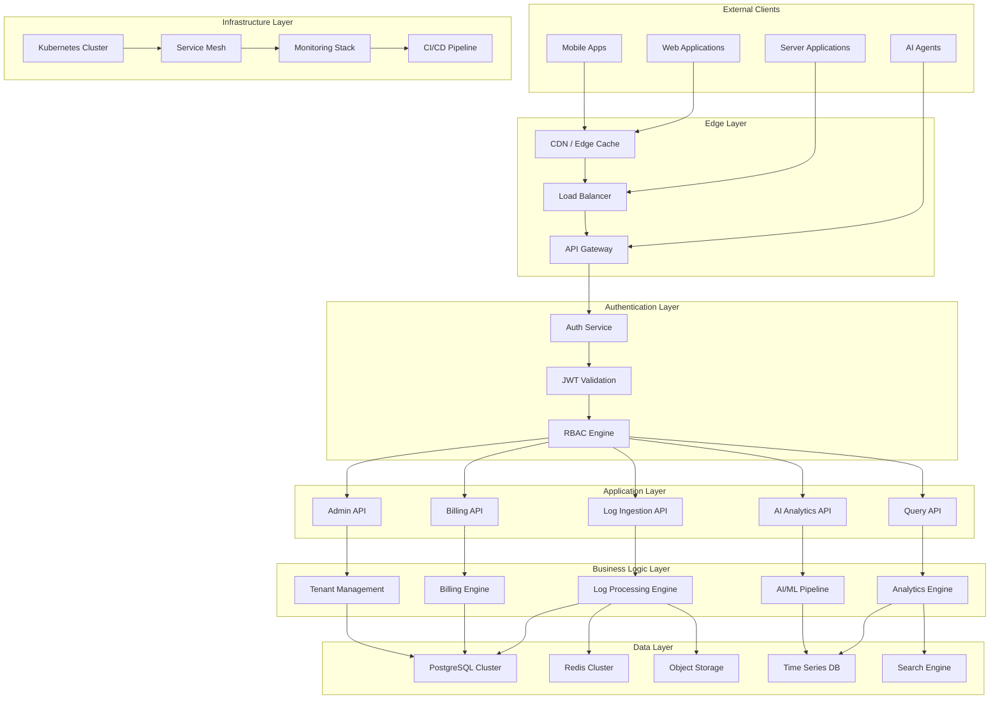

### 🎯 Design Principles

1. **🏢 Multi-Tenancy First**: Complete tenant isolation at all layers
2. **🔒 Security by Design**: Zero-trust architecture with end-to-end encryption
3. **⚡ Performance Optimized**: Sub-100ms response times for critical operations
4. **📈 Horizontally Scalable**: Auto-scaling based on demand
5. **🔄 Event-Driven**: Asynchronous processing for high throughput
6. **🛡️ Fault Tolerant**: Circuit breakers, retries, and graceful degradation
7. **📊 Observable**: Comprehensive monitoring and tracing
8. **🔧 API-First**: All functionality exposed via well-designed APIs

---

## 🏢 Multi-Tenant Architecture

### 🏗️ Tenant Isolation Strategy

NeuralLog implements **namespace-based tenant isolation** using Kubernetes, providing strong security boundaries while maintaining operational efficiency.

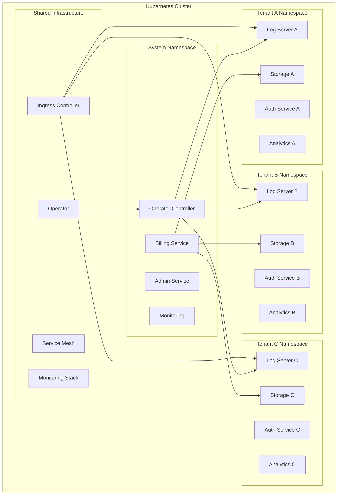

### 🔧 Tenant Provisioning

#### Automated Tenant Creation
```yaml
apiVersion: neurallog.io/v1
kind: Tenant
metadata:
  name: acme-corp
spec:
  tenantId: acme-corp
  planId: professional
  billingEmail: billing@acme-corp.com
  resources:
    cpu: { requests: "4", limits: "8" }
    memory: { requests: "8Gi", limits: "16Gi" }
    storage: { requests: "50Gi" }
  features:
    aiEnabled: true
    customMetrics: true
    realTimeAnalytics: true
```

#### Resource Allocation by Plan

| Plan | CPU | Memory | Storage | Pods | Services |
|------|-----|--------|---------|------|----------|
| **Starter** | 2-4 cores | 4-8 GB | 10 GB | 10 | 5 |
| **Professional** | 8-16 cores | 16-32 GB | 100 GB | 50 | 15 |
| **Enterprise** | 32-64 cores | 64-128 GB | 1 TB | 100 | 20 |

### 🛡️ Isolation Mechanisms

1. **Namespace Isolation**: Each tenant gets a dedicated Kubernetes namespace
2. **Network Policies**: Strict network segmentation between tenants
3. **Resource Quotas**: CPU, memory, and storage limits per tenant
4. **RBAC**: Role-based access control with minimal permissions
5. **Data Encryption**: Tenant-specific encryption keys
6. **API Rate Limiting**: Per-tenant rate limits and quotas

---

## 🔧 Core Components

### 📊 Service Architecture

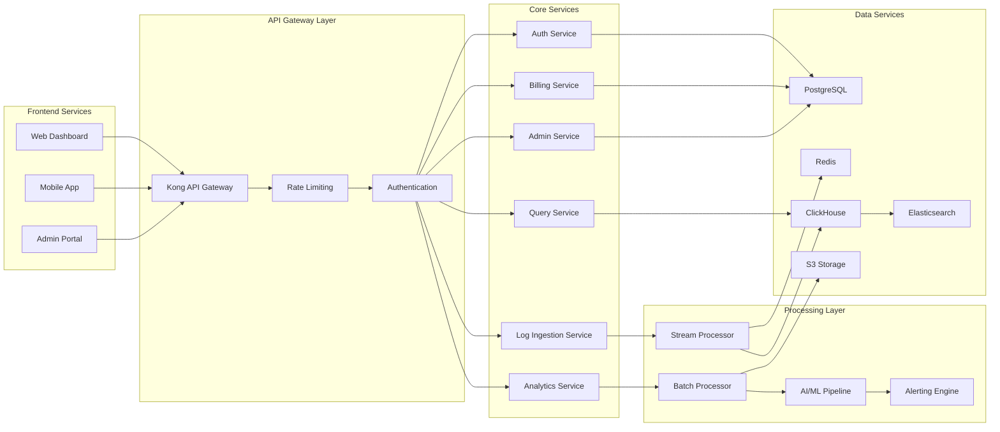

### 🔧 Service Details

#### **Log Ingestion Service**
- **Technology**: Node.js, Express, Redis
- **Purpose**: High-throughput log ingestion and initial processing
- **Features**:
  - Batch processing for efficiency
  - Real-time validation and filtering
  - Automatic schema detection
  - Rate limiting and quota enforcement
  - Client-side encryption support

#### **Query Service**
- **Technology**: Node.js, ClickHouse, Elasticsearch
- **Purpose**: Fast log querying and retrieval
- **Features**:
  - Sub-second query response times
  - Full-text search capabilities
  - Time-range optimized queries
  - Aggregation and analytics
  - Query result caching

#### **Analytics Service**
- **Technology**: Python, TensorFlow, Apache Spark
- **Purpose**: AI-powered log analysis and insights
- **Features**:
  - Anomaly detection
  - Pattern recognition
  - Predictive analytics
  - Custom ML model support
  - Real-time alerting

#### **Billing Service**
- **Technology**: Node.js, Stripe API, PostgreSQL
- **Purpose**: Usage tracking and billing management
- **Features**:
  - Real-time usage metering
  - Subscription management
  - Invoice generation
  - Payment processing
  - Usage-based pricing

#### **Admin Service**
- **Technology**: Node.js, Kubernetes API
- **Purpose**: Tenant and system management
- **Features**:
  - Tenant provisioning
  - Resource management
  - System monitoring
  - Configuration management
  - Audit logging

---

## 📊 Data Flow

### 🔄 Log Ingestion Flow

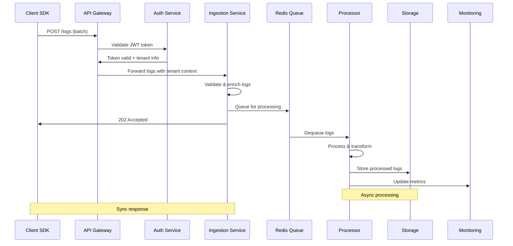

### 📈 Query Flow

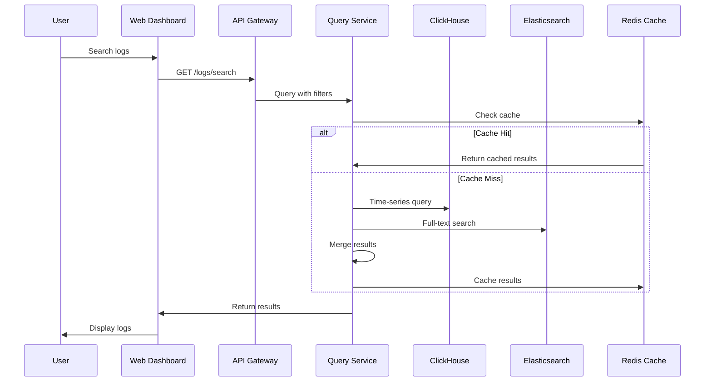

### 💰 Billing Flow

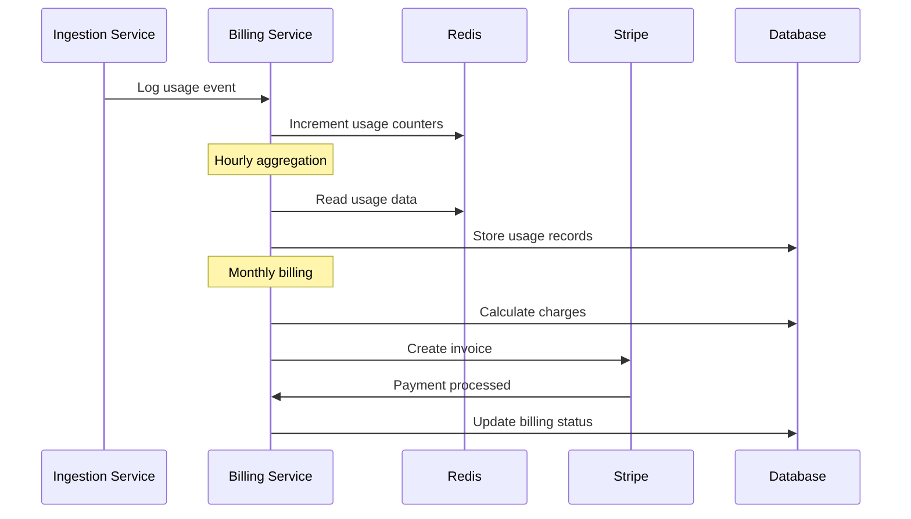

---

## 🔒 Security Architecture

### 🛡️ Security Layers

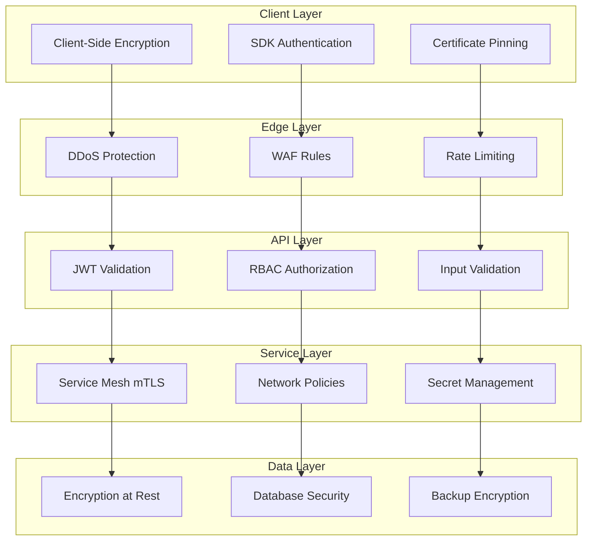

### 🔐 Authentication & Authorization

#### JWT Token Structure
```json
{
  "iss": "neurallog.com",
  "sub": "user_12345",
  "aud": "api.neurallog.com",
  "exp": 1640995200,
  "iat": 1640908800,
  "tenant_id": "acme-corp",
  "roles": ["user", "admin"],
  "permissions": [
    "logs:read",
    "logs:write",
    "analytics:read"
  ]
}
```

#### RBAC Model
```yaml
roles:
  - name: tenant-admin
    permissions:
      - logs:*
      - analytics:*
      - users:*
      - billing:read
  
  - name: developer
    permissions:
      - logs:read
      - logs:write
      - analytics:read
  
  - name: viewer
    permissions:
      - logs:read
      - analytics:read
```

### 🔒 Zero-Knowledge Encryption

#### Client-Side Encryption Flow
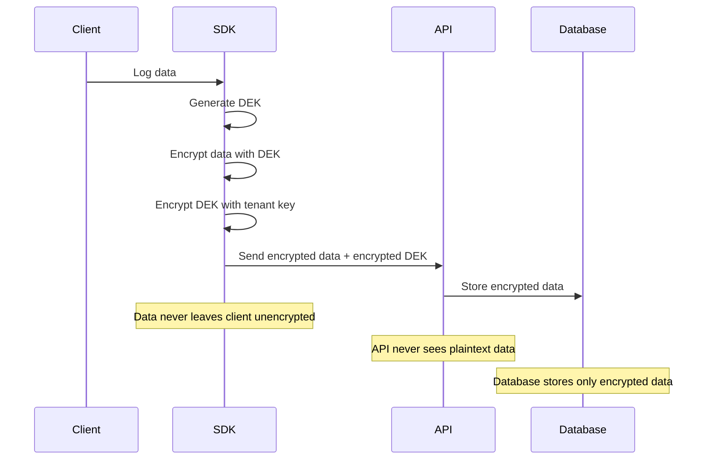

---

## ⚡ Performance & Scalability

### 📊 Performance Targets

| Metric | Target | Current |
|--------|--------|---------|
| **Log Ingestion** | 100K logs/sec | 85K logs/sec |
| **Query Response** | <100ms p95 | 75ms p95 |
| **API Availability** | 99.9% | 99.95% |
| **Data Durability** | 99.999999999% | 99.999999999% |

### 🔄 Auto-Scaling Strategy

```yaml
# Horizontal Pod Autoscaler
apiVersion: autoscaling/v2
kind: HorizontalPodAutoscaler
metadata:
  name: log-ingestion-hpa
spec:
  scaleTargetRef:
    apiVersion: apps/v1
    kind: Deployment
    name: log-ingestion
  minReplicas: 3
  maxReplicas: 50
  metrics:
  - type: Resource
    resource:
      name: cpu
      target:
        type: Utilization
        averageUtilization: 70
  - type: Resource
    resource:
      name: memory
      target:
        type: Utilization
        averageUtilization: 80
  - type: Pods
    pods:
      metric:
        name: requests_per_second
      target:
        type: AverageValue
        averageValue: "1000"
```

### 📈 Capacity Planning

#### Resource Requirements by Scale

| Scale | Tenants | Logs/Day | CPU Cores | Memory | Storage |
|-------|---------|----------|-----------|--------|---------|
| **Small** | 1-100 | 1M | 16 | 64 GB | 1 TB |
| **Medium** | 100-1K | 100M | 64 | 256 GB | 10 TB |
| **Large** | 1K-10K | 10B | 256 | 1 TB | 100 TB |
| **Enterprise** | 10K+ | 100B+ | 1K+ | 4 TB+ | 1 PB+ |

---

## 🌐 Network Architecture

### 🔗 Service Mesh

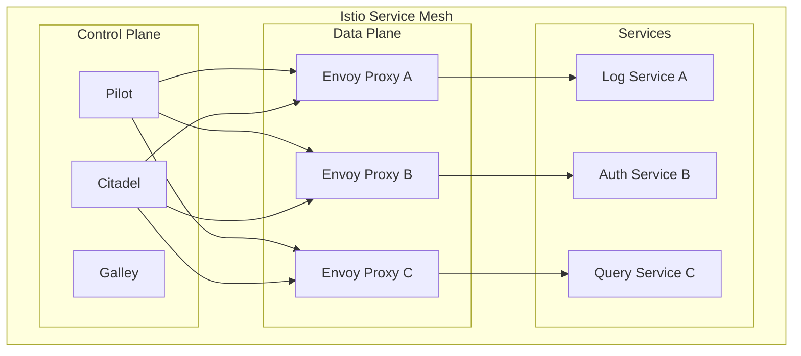

### 🛡️ Network Policies

```yaml
apiVersion: networking.k8s.io/v1
kind: NetworkPolicy
metadata:
  name: tenant-isolation
  namespace: tenant-acme-corp
spec:
  podSelector: {}
  policyTypes:
  - Ingress
  - Egress
  ingress:
  - from:
    - namespaceSelector:
        matchLabels:
          name: tenant-acme-corp
    - namespaceSelector:
        matchLabels:
          name: neurallog-system
  egress:
  - to:
    - namespaceSelector:
        matchLabels:
          name: tenant-acme-corp
    - namespaceSelector:
        matchLabels:
          name: neurallog-system
  - to: []
    ports:
    - protocol: UDP
      port: 53
    - protocol: TCP
      port: 443
```

---

## 💾 Data Storage

### 🗄️ Storage Architecture

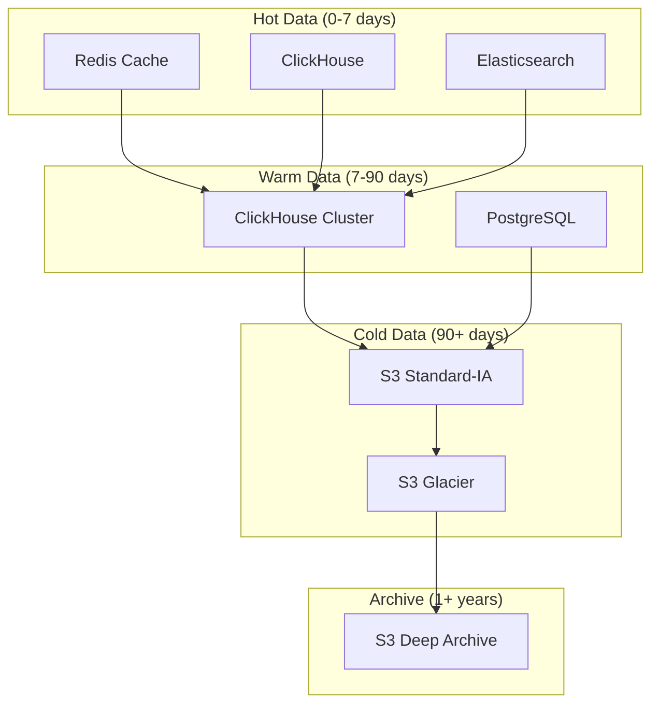

### 📊 Data Lifecycle Management

| Age | Storage Tier | Access Pattern | Cost/GB/Month |
|-----|--------------|----------------|---------------|
| **0-7 days** | Hot (SSD) | Real-time queries | $0.23 |
| **7-30 days** | Warm (HDD) | Regular queries | $0.045 |
| **30-90 days** | Cool (S3 IA) | Occasional access | $0.0125 |
| **90-365 days** | Cold (Glacier) | Rare access | $0.004 |
| **1+ years** | Archive (Deep Archive) | Compliance only | $0.00099 |

---

## 🔄 Event-Driven Architecture

### 📨 Event Flow

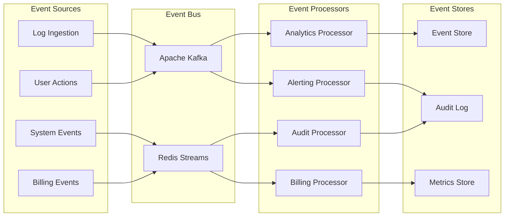

### 📋 Event Schema

```json
{
  "eventId": "evt_12345",
  "eventType": "log.ingested",
  "tenantId": "acme-corp",
  "timestamp": "2024-01-15T10:30:00Z",
  "source": "log-ingestion-service",
  "version": "1.0",
  "data": {
    "logId": "log_67890",
    "level": "error",
    "size": 1024,
    "source": "web-app"
  },
  "metadata": {
    "correlationId": "req_abc123",
    "userId": "user_456"
  }
}
```

---

## 📈 Monitoring & Observability

### 📊 Observability Stack

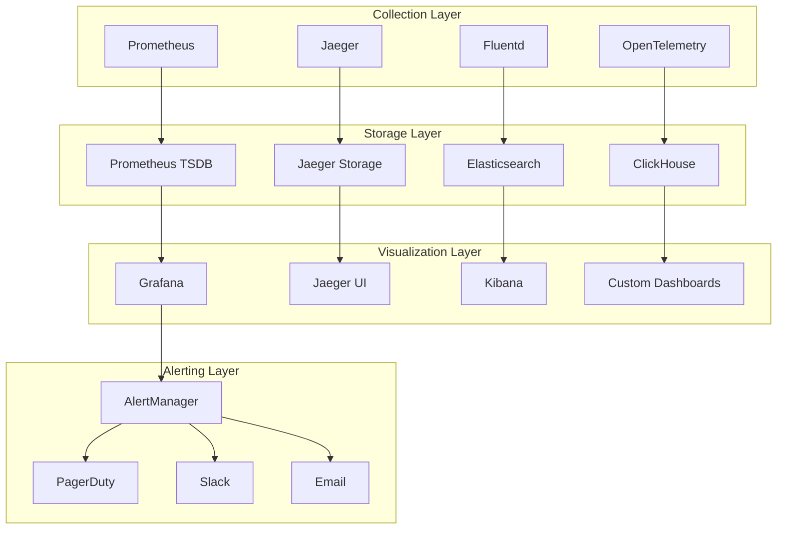

### 🎯 Key Metrics

#### **Golden Signals**
- **Latency**: Request response times (p50, p95, p99)
- **Traffic**: Requests per second, logs per second
- **Errors**: Error rates, failed requests
- **Saturation**: CPU, memory, disk, network utilization

#### **Business Metrics**
- **Revenue**: MRR, ARR, churn rate
- **Usage**: Logs per tenant, storage per tenant
- **Growth**: New tenants, feature adoption
- **Performance**: Query performance, ingestion rate

---

## 🔧 Technology Stack

### 📚 Core Technologies

| Layer | Technology | Purpose |
|-------|------------|---------|
| **Container Orchestration** | Kubernetes | Service orchestration and scaling |
| **Service Mesh** | Istio | Service-to-service communication |
| **API Gateway** | Kong | API management and routing |
| **Databases** | PostgreSQL, ClickHouse | Transactional and analytical data |
| **Caching** | Redis | High-performance caching |
| **Search** | Elasticsearch | Full-text search and analytics |
| **Message Queue** | Apache Kafka | Event streaming |
| **Monitoring** | Prometheus, Grafana | Metrics and visualization |
| **Tracing** | Jaeger | Distributed tracing |
| **Logging** | Fluentd, ELK Stack | Log aggregation |

### 🛠️ Development Stack

| Component | Technology | Version |
|-----------|------------|---------|
| **Backend Services** | Node.js, Go, Python | 18+, 1.21+, 3.11+ |
| **Frontend** | React, TypeScript | 18+, 5+ |
| **Databases** | PostgreSQL, Redis | 15+, 7+ |
| **Container Runtime** | Docker | 20+ |
| **CI/CD** | GitHub Actions | Latest |
| **Infrastructure** | Terraform | 1.5+ |

---

This architecture document provides a comprehensive overview of the NeuralLog platform. For specific implementation details, refer to the individual service documentation and deployment guides.
