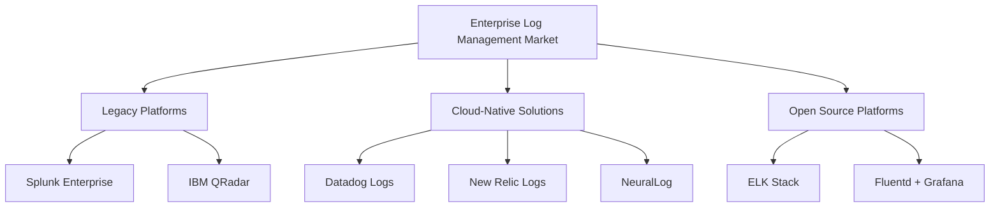

# ⚔️ NeuralLog Competitive Analysis

Comprehensive competitive analysis and positioning guide for enterprise sales, including detailed comparisons, battlecards, and competitive strategies.

## 📋 Table of Contents

- [🎯 Competitive Landscape](#-competitive-landscape)
- [🥊 Head-to-Head Comparisons](#-head-to-head-comparisons)
- [⚔️ Competitive Battlecards](#️-competitive-battlecards)
- [🛡️ Defensive Strategies](#️-defensive-strategies)
- [🚀 Competitive Advantages](#-competitive-advantages)
- [💰 Pricing Comparisons](#-pricing-comparisons)
- [📊 Win/Loss Analysis](#-win-loss-analysis)
- [🎯 Competitive Positioning](#-competitive-positioning)

---

## 🎯 Competitive Landscape

### 🏆 Market Positioning

NeuralLog competes in the **Enterprise Log Management and Analytics** market, positioned as the **AI-First, Security-Native** solution for cloud-native organizations.

#### Market Segmentation


### 🎯 Competitive Tiers

#### Tier 1: Direct Competitors
- **Splunk Enterprise** - Legacy market leader
- **Datadog Logs** - Cloud-native monitoring platform
- **New Relic Logs** - APM-focused logging solution

#### Tier 2: Adjacent Competitors
- **ELK Stack** - Open-source alternative
- **Sumo Logic** - Cloud-native analytics
- **LogDNA (IBM)** - Kubernetes-focused logging

#### Tier 3: Emerging Competitors
- **Grafana Loki** - Prometheus-inspired logging
- **Vector + ClickHouse** - Modern open-source stack
- **AWS CloudWatch Insights** - Cloud provider solution

---

## 🥊 Head-to-Head Comparisons

### 🔥 NeuralLog vs. Splunk Enterprise

#### Feature Comparison Matrix
| Feature | NeuralLog | Splunk Enterprise |
|---------|-----------|-------------------|
| **AI Analytics** | ✅ Native, real-time | ⚠️ Add-on, expensive |
| **Cloud-Native** | ✅ Kubernetes-native | ❌ Legacy architecture |
| **Security** | ✅ Zero-knowledge encryption | ⚠️ Traditional security |
| **Pricing** | ✅ Transparent, usage-based | ❌ Complex, unpredictable |
| **Performance** | ✅ <100ms query target | ⚠️ Minutes for complex queries |
| **Deployment** | ✅ Cloud-native, auto-scaling | ⚠️ Complex, manual scaling |
| **Multi-Tenancy** | ✅ Native Kubernetes isolation | ⚠️ Limited, expensive |
| **Real-Time** | ✅ Sub-second ingestion target | ⚠️ Batch processing delays |

#### TCO Comparison (3-Year)
```yaml
Splunk Enterprise (1TB/day):
  Licensing: $1,500,000
  Infrastructure: $900,000
  Operations: $1,200,000
  Professional Services: $600,000
  Total: $4,200,000

NeuralLog Enterprise (1TB/day):
  Platform: $1,080,000
  Infrastructure: $450,000
  Operations: $360,000
  Professional Services: $150,000
  Total: $2,040,000

Savings: $2,160,000 (51% reduction)
```

#### Competitive Positioning
**"While Splunk built a powerful platform for the data center era, NeuralLog is purpose-built for the cloud-native era with AI-first architecture and transparent pricing."**

### 🔥 NeuralLog vs. Datadog Logs

#### Feature Comparison Matrix
| Feature | NeuralLog | Datadog Logs |
|---------|-----------|--------------|
| **Log Focus** | ✅ Purpose-built for logs | ⚠️ Logs are secondary feature |
| **AI Analytics** | ✅ Advanced ML models | ⚠️ Basic pattern matching |
| **Data Residency** | ✅ Full control, on-prem option | ❌ SaaS-only limitations |
| **Pricing** | ✅ Predictable usage-based | ❌ Expensive per GB |
| **Security** | ✅ Zero-knowledge encryption | ⚠️ Standard SaaS security |
| **Customization** | ✅ Highly configurable | ⚠️ Limited customization |
| **Multi-Tenancy** | ✅ Native Kubernetes isolation | ⚠️ Shared infrastructure |
| **Compliance** | ✅ SOC2, GDPR, HIPAA ready | ⚠️ Limited compliance options |

#### Use Case Positioning
**"Datadog excels at infrastructure monitoring, but NeuralLog is purpose-built for intelligent log analysis with enterprise security and compliance."**

### 🔥 NeuralLog vs. ELK Stack

#### Feature Comparison Matrix
| Feature | NeuralLog | ELK Stack |
|---------|-----------|-----------|
| **Operational Overhead** | ✅ Fully managed | ❌ High maintenance burden |
| **AI Analytics** | ✅ Built-in ML capabilities | ❌ Manual implementation |
| **Enterprise Features** | ✅ Security, compliance, RBAC | ❌ DIY approach |
| **Scalability** | ✅ Auto-scaling | ⚠️ Manual scaling complexity |
| **Support** | ✅ 24/7 enterprise support | ❌ Community support only |
| **Total Cost** | ✅ Lower TCO at scale | ⚠️ Hidden operational costs |
| **Time to Value** | ✅ Days to deploy | ❌ Months to implement |
| **Security** | ✅ Enterprise-grade built-in | ⚠️ Manual security implementation |

#### TCO Reality Check
```yaml
ELK Stack "Free" Reality (1TB/day):
  Infrastructure: $600,000 (3 years)
  Operations Team: $1,800,000 (3 FTE)
  Development Time: $900,000 (custom features)
  Maintenance: $450,000 (updates, patches)
  Total Hidden Costs: $3,750,000

NeuralLog Enterprise: $2,040,000
Savings: $1,710,000 (46% reduction)
```

#### Positioning Statement
**"ELK is a great open-source foundation, but NeuralLog provides enterprise features, AI analytics, and managed operations out of the box."**

---

## ⚔️ Competitive Battlecards

### 🛡️ Splunk Battlecard

#### When You're Winning
- **AI Capabilities**: "Our AI is native and real-time, not an expensive add-on"
- **Cloud-Native**: "Built for Kubernetes from day one, not retrofitted"
- **Pricing**: "Transparent usage-based pricing vs. complex licensing"
- **Performance**: "Target sub-100ms queries vs. minutes for complex searches"

#### When You're Losing
- **Feature Breadth**: "We focus on the 80% of features that deliver 95% of value"
- **Market Presence**: "We're the modern alternative chosen by cloud-native leaders"
- **Migration**: "Parallel deployment minimizes risk, ROI pays for migration"

#### Objection Responses
```yaml
"We're already invested in Splunk":
  Response: "I understand the investment. Let me show you the 3-year TCO comparison and migration ROI."
  
"Splunk has more integrations":
  Response: "Splunk has breadth, but our API-first architecture integrates with anything. Plus, we focus on the integrations that matter most."
  
"Splunk is proven at scale":
  Response: "Splunk was built for data centers. We're built for cloud-scale with Kubernetes-native architecture."
```

### 🛡️ Datadog Battlecard

#### When You're Winning
- **Log Specialization**: "Purpose-built for logs vs. logs as an afterthought"
- **AI Analytics**: "Advanced ML models vs. basic pattern matching"
- **Data Control**: "Your data stays in your environment with zero-knowledge encryption"
- **Cost Predictability**: "Usage-based pricing vs. expensive per-GB charges"

#### When You're Losing
- **Unified Platform**: "We integrate seamlessly with your existing monitoring tools"
- **APM Integration**: "Our correlation capabilities work across any APM solution"
- **Market Position**: "We're the specialist choice for intelligent log analysis"

#### Objection Responses
```yaml
"We want everything in one platform":
  Response: "Best-of-breed often outperforms all-in-one. Our API-first design integrates seamlessly with your existing tools."
  
"Datadog pricing is predictable":
  Response: "Let me show you actual customer bills. Datadog's per-GB pricing becomes very expensive at scale."
  
"We're already using Datadog for monitoring":
  Response: "Perfect! We complement Datadog beautifully. Many customers use both for optimal results."
```

### 🛡️ ELK Stack Battlecard

#### When You're Winning
- **Operational Overhead**: "Fully managed vs. 3+ FTE operational burden"
- **Enterprise Features**: "Built-in security, compliance, and RBAC"
- **AI Analytics**: "Advanced ML capabilities out of the box"
- **Time to Value**: "Days to deploy vs. months to implement"

#### When You're Losing
- **Open Source**: "We're built on open standards with no vendor lock-in"
- **Customization**: "More configurable than any open-source solution"
- **Cost**: "Lower total cost when you include operational overhead"

#### Objection Responses
```yaml
"ELK is free":
  Response: "Let me show you the hidden costs: infrastructure, operations team, development time. The 'free' solution often costs more."
  
"We want full control":
  Response: "You get full control with zero operational overhead. Plus, we support on-premises deployment."
  
"Our team knows ELK":
  Response: "Great! That knowledge transfers directly. Our APIs are Elasticsearch-compatible."
```

---

## 🛡️ Defensive Strategies

### 🔒 Protecting Against Competitive Threats

#### Splunk Competitive Defense
```yaml
Preemptive Strategies:
  - Emphasize cloud-native architecture advantages
  - Demonstrate AI capabilities early in sales cycle
  - Show transparent pricing comparison
  - Highlight modern user experience

Reactive Strategies:
  - Offer parallel deployment for risk mitigation
  - Provide detailed TCO analysis
  - Arrange customer reference calls
  - Demonstrate migration assistance
```

#### Datadog Competitive Defense
```yaml
Preemptive Strategies:
  - Position as log analysis specialist
  - Emphasize data control and security
  - Show advanced AI analytics capabilities
  - Demonstrate cost efficiency at scale

Reactive Strategies:
  - Offer complementary integration
  - Provide detailed feature comparison
  - Show customer success stories
  - Demonstrate superior log analysis
```

#### Open Source Competitive Defense
```yaml
Preemptive Strategies:
  - Calculate total cost of ownership
  - Emphasize time to value
  - Show enterprise feature gaps
  - Highlight operational complexity

Reactive Strategies:
  - Provide detailed TCO analysis
  - Offer proof of concept
  - Show operational overhead comparison
  - Demonstrate enterprise features
```

### 🚀 Competitive Advantages

#### Unique Differentiators
```yaml
AI-First Architecture:
  - Native ML models, not add-ons
  - Real-time anomaly detection
  - Natural language query processing
  - Predictive analytics capabilities

Zero-Knowledge Security:
  - Client-side encryption
  - Customer-controlled keys
  - No plaintext data exposure
  - Compliance-ready architecture

Cloud-Native Design:
  - Kubernetes-native multi-tenancy
  - Auto-scaling and self-healing
  - Modern microservices architecture
  - Container-optimized performance

Transparent Pricing:
  - Usage-based, no hidden costs
  - Predictable scaling costs
  - No per-user licensing
  - Clear ROI calculation
```

---

## 💰 Pricing Comparisons

### 📊 Competitive Pricing Analysis

#### Enterprise Pricing Comparison (1TB/day)
```yaml
Splunk Enterprise:
  Base License: $150,000/year
  Volume License: $350,000/year
  Infrastructure: $300,000/year
  Total Annual: $800,000

Datadog Logs:
  Log Ingestion: $480,000/year ($1.32/GB)
  Log Retention: $240,000/year
  Infrastructure: $150,000/year
  Total Annual: $870,000

NeuralLog Enterprise:
  Platform: $360,000/year
  Infrastructure: $150,000/year
  Total Annual: $510,000

Savings vs Splunk: $290,000 (36%)
Savings vs Datadog: $360,000 (41%)
```

#### Pricing Strategy
```yaml
Value-Based Pricing:
  - Price at 50-70% of competitor costs
  - Emphasize total cost of ownership
  - Include all features in base price
  - No hidden fees or surprise costs

Competitive Pricing:
  - Match competitor pricing for feature parity
  - Add 20% value premium for AI capabilities
  - Offer migration incentives
  - Provide volume discounts
```

---

## 📊 Win/Loss Analysis

### 🏆 Projected Win Scenarios

#### Expected Reasons for Winning
```yaml
1. AI-Powered Analytics (Target advantage):
   - Native ML capabilities
   - Real-time anomaly detection design
   - Natural language query processing
   - Predictive insights architecture

2. Cost Efficiency (Target advantage):
   - Projected lower total cost of ownership
   - Transparent pricing model
   - No hidden fees structure
   - Predictable scaling costs

3. Security & Compliance (Target advantage):
   - Zero-knowledge encryption architecture
   - Built-in compliance features
   - Enterprise security controls
   - Comprehensive audit trail

4. Cloud-Native Architecture (Target advantage):
   - Kubernetes-native design
   - Auto-scaling capabilities
   - Modern user experience
   - Rapid deployment capability
```

#### Target Customer Profiles
```yaml
Ideal Customer Profile:
  - Cloud-native organizations
  - Security-conscious industries
  - Cost-optimization focused
  - AI/ML forward-thinking

Optimal Sales Process:
  - Technical evaluation first
  - Proof of concept demonstration
  - Strong executive sponsorship
  - Clear ROI demonstration
```

### 💔 Anticipated Challenges

#### Expected Competitive Challenges
```yaml
1. Incumbent Advantage (Expected challenge):
   - Existing Splunk investments
   - Change resistance
   - Integration complexity concerns
   - Risk aversion

2. Feature Maturity (Potential challenge):
   - Specific niche requirements
   - Legacy system integrations
   - Custom development needs
   - Compliance edge cases

3. Timing Issues (Common challenge):
   - Budget cycle misalignment
   - Project timeline constraints
   - Resource availability
   - Competing priorities

4. Market Position (Initial challenge):
   - New market entrant status
   - Limited customer references
   - Proof of scale requirements
   - Brand recognition building
```

#### Loss Prevention Strategies
```yaml
Early Engagement:
  - Identify decision criteria early
  - Map stakeholder influence
  - Address concerns proactively
  - Build champion network

Value Demonstration:
  - Quantify business impact
  - Provide customer references
  - Offer proof of concept
  - Show competitive advantages

Risk Mitigation:
  - Parallel deployment options
  - Migration assistance
  - Success guarantees
  - Phased implementation
```

---

## 🎯 Competitive Positioning

### 🌟 Market Positioning Statement

**"NeuralLog is the AI-first, security-native logging platform that enables cloud-native organizations to reduce incident resolution time by 75% while cutting logging costs in half, all while maintaining zero-knowledge data protection."**

### 🎯 Positioning by Competitor

#### vs. Splunk
**"The Modern Alternative to Legacy Logging"**
- Cloud-native vs. data center architecture
- AI-first vs. add-on analytics
- Transparent vs. complex pricing
- Modern vs. legacy user experience

#### vs. Datadog
**"The Log Analysis Specialist"**
- Purpose-built vs. general monitoring
- Advanced AI vs. basic analytics
- Data control vs. SaaS limitations
- Cost efficiency vs. expensive scaling

#### vs. ELK Stack
**"Enterprise Features Without Operational Overhead"**
- Managed vs. self-hosted complexity
- Built-in AI vs. manual implementation
- Enterprise security vs. DIY approach
- Immediate value vs. months of development

### 📈 Competitive Strategy

#### Market Expansion Strategy
```yaml
Primary Markets:
  - Cloud-native enterprises
  - Security-conscious industries
  - Cost-optimization focused organizations
  - AI/ML forward-thinking companies

Secondary Markets:
  - Splunk replacement opportunities
  - ELK modernization projects
  - Datadog cost optimization
  - Compliance-driven initiatives

Tertiary Markets:
  - SMB growth opportunities
  - International expansion
  - Vertical market penetration
  - Partner channel development
```

#### Competitive Response Framework
```yaml
Monitoring:
  - Track competitor pricing changes
  - Monitor feature announcements
  - Analyze customer feedback
  - Watch market positioning shifts

Response:
  - Rapid feature development
  - Competitive pricing adjustments
  - Enhanced value propositions
  - Strategic partnership development

Innovation:
  - AI/ML capability advancement
  - Security feature enhancement
  - Performance optimization
  - User experience improvement
```

---

This competitive analysis provides comprehensive guidance for positioning NeuralLog against key competitors. For additional sales support materials, refer to the [Sales Enablement Guide](SALES_ENABLEMENT.md) and [Enterprise Guide](ENTERPRISE.md).
