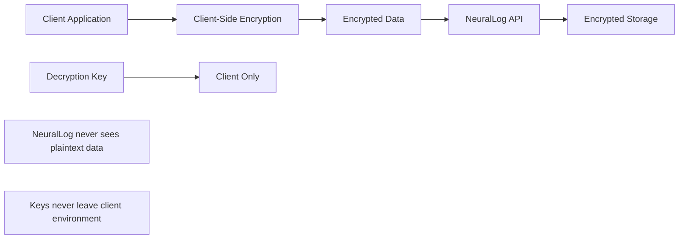
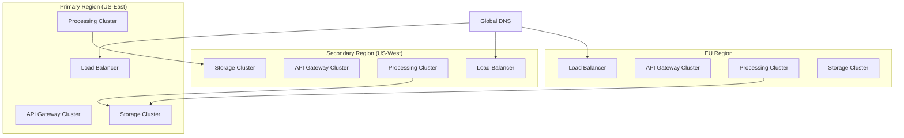

# 🏢 NeuralLog Enterprise Guide

Comprehensive guide for enterprise customers, including technical specifications, security compliance, implementation planning, and onboarding procedures.

## 📋 Table of Contents

- [🎯 Executive Summary](#-executive-summary)
- [💼 Enterprise Value Proposition](#-enterprise-value-proposition)
- [🔒 Security & Compliance](#-security--compliance)
- [🏗️ Technical Specifications](#️-technical-specifications)
- [📊 Implementation Planning](#-implementation-planning)
- [🚀 Onboarding Process](#-onboarding-process)
- [📈 Success Metrics](#-success-metrics)
- [🆘 Enterprise Support](#-enterprise-support)

---

## 🎯 Executive Summary

### 🌟 NeuralLog Enterprise Platform

NeuralLog is an **AI-powered, cloud-native logging and analytics platform** designed for enterprise-scale operations. Built with security-first architecture and multi-tenant isolation, NeuralLog enables organizations to gain unprecedented insights from their application logs while maintaining the highest standards of data protection and compliance.

#### Key Enterprise Benefits
- **🤖 AI-Powered Insights**: Reduce MTTR by 75% with intelligent anomaly detection
- **🔒 Zero-Knowledge Security**: Client-side encryption ensures data never leaves your control
- **📈 Operational Efficiency**: Centralized logging reduces operational overhead by 60%
- **💰 Cost Optimization**: Usage-based pricing scales with your actual needs
- **⚡ Performance**: Sub-100ms query response times at enterprise scale

### 📊 Enterprise ROI Projections

#### Projected Business Impact
```
Year 1 ROI Projection (1000-employee organization):

Potential Cost Savings:
• Reduced MTTR: Up to $2.4M annually (target 75% reduction)
• Operational Efficiency: Up to $1.8M annually (estimated 3 FTE savings)
• Infrastructure Consolidation: Up to $600K annually
• Compliance Automation: Up to $400K annually

Total Projected Annual Savings: Up to $5.2M
NeuralLog Enterprise Cost: $360K annually
Projected Net ROI: Up to 1,344% (13.4x return)
```

#### Projected Time to Value
- **Week 1**: Initial deployment and basic log ingestion
- **Week 2**: AI analytics and anomaly detection activation
- **Week 4**: Full team onboarding and advanced features
- **Month 2**: Target ROI realization and optimization

---

## 💼 Enterprise Value Proposition

### 🎯 Core Value Drivers

#### 1. **Operational Excellence**
- **Unified Observability**: Single pane of glass for all application logs
- **Intelligent Alerting**: AI-powered alerts designed to reduce noise by up to 90%
- **Automated Root Cause Analysis**: Identify issues before they impact customers
- **Predictive Analytics**: Forecast potential problems and capacity needs

#### 2. **Security & Compliance**
- **Zero-Knowledge Architecture**: Your data remains encrypted at all times
- **SOC 2 Type II Ready**: Enterprise-grade security controls (certification in progress)
- **GDPR Compliant**: Built-in data privacy and protection
- **Audit Trail**: Complete activity logging for compliance requirements

#### 3. **Developer Productivity**
- **Faster Debugging**: Target time to resolution reduction of up to 75%
- **Contextual Insights**: Correlate logs across services and users
- **Natural Language Queries**: Ask questions in plain English
- **Custom Dashboards**: Role-based views for different teams

#### 4. **Cost Efficiency**
- **Usage-Based Pricing**: Pay only for what you use
- **Infrastructure Optimization**: Target logging infrastructure cost reduction of up to 50%
- **Automated Retention**: Intelligent data lifecycle management
- **Resource Right-Sizing**: AI-powered capacity recommendations

### 🏆 Competitive Advantages

| Feature | NeuralLog | Splunk | Datadog | ELK Stack |
|---------|-----------|--------|---------|-----------|
| **AI-Powered Analytics** | ✅ Native | ❌ Add-on | ⚠️ Limited | ❌ Manual |
| **Zero-Knowledge Encryption** | ✅ Built-in | ❌ No | ❌ No | ❌ No |
| **Multi-Tenant Isolation** | ✅ Kubernetes | ⚠️ Limited | ⚠️ Limited | ❌ Manual |
| **Usage-Based Pricing** | ✅ Transparent | ❌ Complex | ❌ Expensive | ⚠️ Hidden Costs |
| **Cloud-Native** | ✅ Kubernetes | ⚠️ Hybrid | ✅ SaaS Only | ⚠️ Self-Managed |
| **Real-Time Processing** | ✅ <100ms | ⚠️ Minutes | ✅ Seconds | ⚠️ Variable |

---

## 🔒 Security & Compliance

### 🛡️ Security Architecture

#### Zero-Knowledge Encryption


#### Security Controls
- **🔐 End-to-End Encryption**: AES-256 encryption with client-managed keys
- **🔑 Key Management**: Integration with enterprise key management systems
- **🛡️ Network Security**: VPC isolation and private endpoints
- **👤 Identity & Access**: SSO integration with enterprise identity providers
- **📋 Audit Logging**: Complete audit trail of all access and operations

### 📜 Compliance Certifications

#### Planned Certifications
- **🎯 SOC 2 Type II**: Security, availability, and confidentiality (in progress)
- **🎯 GDPR Compliant**: Data privacy and protection regulations (architecture ready)
- **🎯 ISO 27001**: Information security management (planned)
- **🎯 HIPAA Ready**: Healthcare data protection (BAA available upon certification)

#### Future Roadmap
- **📋 SOC 2 Type I**: Initial certification target
- **📋 FedRAMP**: Federal government compliance (planned)
- **📋 PCI DSS**: Payment card industry standards (planned)

#### Compliance Features
```yaml
Data Residency:
  - US: AWS us-east-1, us-west-2
  - EU: AWS eu-west-1, eu-central-1
  - APAC: AWS ap-southeast-1, ap-northeast-1

Data Retention:
  - Configurable: 30 days to 7 years
  - Automatic: Policy-based lifecycle management
  - Legal Hold: Litigation support capabilities

Privacy Controls:
  - Data Anonymization: PII scrubbing and masking
  - Right to Deletion: GDPR Article 17 compliance
  - Data Portability: Export in standard formats
  - Consent Management: Granular privacy controls
```

---

## 🏗️ Technical Specifications

### 📊 Enterprise Scale Requirements

#### Target Performance Specifications
| Metric | Target Specification | Planned SLA |
|--------|---------------------|-------------|
| **Log Ingestion** | Up to 1M logs/second per tenant | 99.9% |
| **Query Response** | <100ms p95 target | 99.5% |
| **API Availability** | 99.99% uptime target | 99.9% |
| **Data Durability** | 99.999999999% (11 9's) target | Planned |

#### Capacity Limits
```yaml
Enterprise Plan Limits:
  Logs per Month: Unlimited
  Storage: Unlimited
  Retention: Up to 7 years
  Users: Unlimited
  API Calls: Unlimited
  Custom Dashboards: Unlimited
  Alerts: Unlimited
  
Burst Capacity:
  Peak Ingestion: 10M logs/second
  Concurrent Queries: 10,000
  Dashboard Users: 1,000 concurrent
```

### 🏗️ Infrastructure Architecture

#### Multi-Region Deployment


#### Technology Stack
```yaml
Container Orchestration:
  Platform: Kubernetes 1.28+
  Service Mesh: Istio
  Ingress: NGINX Ingress Controller
  
Data Layer:
  Primary Database: PostgreSQL 15+ (HA)
  Time Series: ClickHouse Cluster
  Cache: Redis Cluster
  Search: Elasticsearch 8+
  Object Storage: S3-compatible
  
Processing:
  Stream Processing: Apache Kafka
  Batch Processing: Apache Spark
  AI/ML: TensorFlow Serving
  
Monitoring:
  Metrics: Prometheus
  Visualization: Grafana
  Tracing: Jaeger
  Logging: Fluentd
```

### 🔧 Integration Capabilities

#### Enterprise Integrations
- **🔐 Identity Providers**: Okta, Azure AD, Auth0, LDAP
- **📊 Monitoring Tools**: Datadog, New Relic, Splunk, Grafana
- **🚨 Alerting**: PagerDuty, Opsgenie, ServiceNow
- **💬 Communication**: Slack, Microsoft Teams, Email
- **🔄 CI/CD**: Jenkins, GitLab, GitHub Actions, Azure DevOps
- **☁️ Cloud Platforms**: AWS, Azure, GCP, On-premises

#### API & SDK Support
```yaml
REST API:
  Version: v1
  Format: JSON
  Authentication: JWT, API Keys, OAuth 2.0
  Rate Limiting: Configurable per tenant
  
SDKs Available:
  - JavaScript/Node.js
  - Python
  - Go
  - Java
  - C#/.NET
  - Ruby
  - PHP
  
Frameworks:
  - Express.js middleware
  - Django integration
  - Spring Boot starter
  - .NET Core package
```

---

## 📊 Implementation Planning

### 🗓️ Enterprise Implementation Timeline

#### Phase 1: Foundation (Weeks 1-2)
```yaml
Week 1:
  - Infrastructure provisioning
  - Security configuration
  - Initial tenant setup
  - Basic log ingestion testing
  
Week 2:
  - SSO integration
  - Network configuration
  - Monitoring setup
  - User access provisioning
```

#### Phase 2: Integration (Weeks 3-4)
```yaml
Week 3:
  - Application integration
  - SDK deployment
  - Custom dashboard creation
  - Alert configuration
  
Week 4:
  - Advanced features activation
  - AI analytics training
  - Performance optimization
  - User training sessions
```

#### Phase 3: Optimization (Weeks 5-8)
```yaml
Weeks 5-6:
  - Performance tuning
  - Custom integrations
  - Advanced analytics setup
  - Team onboarding
  
Weeks 7-8:
  - Full production deployment
  - Success metrics validation
  - Documentation handover
  - Go-live support
```

### 📋 Pre-Implementation Checklist

#### Technical Requirements
- [ ] **Infrastructure**: Kubernetes cluster with minimum specifications
- [ ] **Network**: VPC setup with private subnets and NAT gateways
- [ ] **Security**: SSL certificates and firewall rules configured
- [ ] **Storage**: Persistent storage with backup capabilities
- [ ] **Monitoring**: Basic monitoring infrastructure in place

#### Organizational Requirements
- [ ] **Stakeholders**: Executive sponsor and technical champion identified
- [ ] **Team**: Implementation team with defined roles and responsibilities
- [ ] **Training**: Training schedule and materials prepared
- [ ] **Change Management**: Communication plan for organization-wide rollout
- [ ] **Success Criteria**: KPIs and success metrics defined

### 🔧 Migration Strategies

#### From Existing Solutions
```yaml
From Splunk:
  Duration: 4-6 weeks
  Approach: Parallel deployment with gradual migration
  Data Migration: Historical data import available
  Downtime: Zero downtime migration
  
From ELK Stack:
  Duration: 2-4 weeks
  Approach: Direct replacement with configuration mapping
  Data Migration: Elasticsearch index migration tools
  Downtime: Minimal (planned maintenance windows)
  
From Datadog:
  Duration: 3-4 weeks
  Approach: API-based migration with dashboard recreation
  Data Migration: Historical metrics and logs
  Downtime: Zero downtime migration
```

---

## 🚀 Onboarding Process

### 👥 Enterprise Onboarding Journey

#### Pre-Sales Phase
1. **🎯 Discovery Call**: Understand requirements and use cases
2. **🔍 Technical Deep Dive**: Architecture review and security assessment
3. **🧪 Proof of Concept**: 30-day trial with real data
4. **💼 Business Case**: ROI analysis and implementation planning
5. **📝 Contract Negotiation**: Terms, SLAs, and pricing finalization

#### Implementation Phase
1. **🚀 Kickoff Meeting**: Project team introduction and timeline review
2. **🏗️ Infrastructure Setup**: Environment provisioning and configuration
3. **🔧 Integration**: Application integration and SDK deployment
4. **🎓 Training**: User training and best practices workshops
5. **✅ Go-Live**: Production deployment and success validation

#### Post-Implementation Phase
1. **📊 Success Review**: KPI validation and optimization recommendations
2. **🔄 Continuous Optimization**: Performance tuning and feature adoption
3. **📈 Quarterly Business Reviews**: ROI tracking and expansion planning
4. **🆘 Ongoing Support**: 24/7 enterprise support and account management

### 🎓 Training Programs

#### Executive Training (2 hours)
- **Business Value**: ROI realization and competitive advantages
- **Strategic Vision**: Platform roadmap and future capabilities
- **Success Metrics**: KPI tracking and business impact measurement

#### Administrator Training (1 day)
- **Platform Administration**: User management and configuration
- **Security Management**: Access controls and compliance features
- **Monitoring & Alerting**: Dashboard creation and alert configuration
- **Troubleshooting**: Common issues and resolution procedures

#### Developer Training (2 days)
- **SDK Integration**: Application integration best practices
- **API Usage**: Advanced API features and optimization
- **Custom Development**: Building custom integrations and extensions
- **Performance Optimization**: Query optimization and efficiency tips

#### End User Training (4 hours)
- **Platform Navigation**: Dashboard usage and search capabilities
- **Log Analysis**: Query techniques and investigation workflows
- **AI Features**: Leveraging AI-powered insights and recommendations
- **Collaboration**: Sharing insights and team workflows

---

## 📈 Success Metrics

### 🎯 Key Performance Indicators

#### Operational Metrics
```yaml
Mean Time to Resolution (MTTR):
  Baseline: Current MTTR
  Target: 75% reduction within 90 days
  Measurement: Incident tracking system integration

Log Analysis Efficiency:
  Baseline: Time spent on log analysis
  Target: 60% reduction in analysis time
  Measurement: User activity tracking

Alert Noise Reduction:
  Baseline: Current alert volume
  Target: 90% reduction in false positives
  Measurement: Alert classification and feedback

System Uptime:
  Baseline: Current application availability
  Target: 99.9% uptime improvement
  Measurement: Synthetic monitoring and SLA tracking
```

#### Business Metrics
```yaml
Cost Savings:
  Infrastructure: 50% reduction in logging costs
  Operations: 3 FTE equivalent savings
  Downtime: 75% reduction in revenue impact
  
Productivity Gains:
  Developer Efficiency: 40% faster debugging
  Operations Team: 60% reduction in manual tasks
  Time to Market: 25% faster feature delivery
  
Customer Satisfaction:
  Application Performance: 30% improvement
  Issue Resolution: 75% faster response times
  User Experience: Measurable improvement in NPS
```

### 📊 Success Tracking Dashboard

#### Real-Time Metrics
- **🔥 Active Incidents**: Current open incidents and MTTR tracking
- **📈 Log Volume**: Real-time ingestion rates and trends
- **⚡ Performance**: Query response times and system health
- **👥 User Adoption**: Active users and feature utilization

#### Historical Analysis
- **📉 Trend Analysis**: Month-over-month improvement tracking
- **💰 Cost Analysis**: ROI calculation and cost optimization
- **🎯 Goal Progress**: Success criteria achievement tracking
- **📋 Compliance**: Audit trail and compliance reporting

---

## 🆘 Enterprise Support

### 🎯 Support Tiers

#### Enterprise Support (Included)
- **⏰ Response Time**: 1 hour for critical issues
- **📞 Support Channels**: Phone, email, chat, video calls
- **👨‍💼 Account Manager**: Dedicated customer success manager
- **🔧 Technical Support**: Senior engineers with platform expertise
- **📚 Resources**: Priority access to documentation and training

#### Premium Support (Add-on)
- **⚡ Response Time**: 15 minutes for critical issues
- **🏥 24/7 Coverage**: Round-the-clock support availability
- **👨‍🔬 Solution Architect**: Dedicated technical architect
- **🔄 Proactive Monitoring**: Health checks and optimization recommendations
- **🎓 Custom Training**: On-site training and workshops

### 📞 Support Channels

#### Primary Channels
```yaml
Critical Issues (P0):
  - Phone: +1-800-NEURALLOG
  - Emergency Escalation: Automatic PagerDuty integration
  - Response Time: 15 minutes (Premium) / 1 hour (Enterprise)
  
Standard Issues (P1-P3):
  - Support Portal: support.neurallog.com
  - Email: enterprise-support@neurallog.com
  - Chat: In-platform support widget
  - Response Time: 4 hours (P1) / 24 hours (P2-P3)
```

#### Self-Service Resources
- **📚 Knowledge Base**: Comprehensive documentation and FAQs
- **🎥 Video Library**: Training videos and tutorials
- **💬 Community Forum**: Peer support and best practices sharing
- **📊 Status Page**: Real-time platform status and maintenance updates

### 🤝 Customer Success Program

#### Onboarding Success
- **📋 Success Plan**: Customized implementation roadmap
- **🎯 Milestone Tracking**: Regular check-ins and progress reviews
- **🏆 Success Criteria**: Clear definition of success metrics
- **📈 Value Realization**: ROI tracking and optimization

#### Ongoing Success
- **📊 Quarterly Reviews**: Business impact assessment and planning
- **🔄 Health Checks**: Platform optimization and best practices
- **📈 Expansion Planning**: Additional use cases and team onboarding
- **🎓 Continuous Learning**: New feature training and adoption

---

## 💼 Enterprise Pricing & Packaging

### 💰 Enterprise Plan Features

#### Core Platform (Included)
- **📊 Unlimited Log Ingestion**: No volume restrictions
- **💾 Flexible Retention**: 30 days to 7 years configurable
- **👥 Unlimited Users**: No user-based pricing
- **🤖 AI Analytics**: Full AI-powered insights and anomaly detection
- **🔒 Enterprise Security**: Zero-knowledge encryption and compliance
- **📈 Custom Dashboards**: Unlimited dashboards and visualizations

#### Enterprise Add-Ons
```yaml
Premium Support: $50,000/year
  - 15-minute response time
  - 24/7 phone support
  - Dedicated solution architect
  - Proactive monitoring

Professional Services: Custom pricing
  - Implementation consulting
  - Custom integrations
  - Training and workshops
  - Migration assistance

Dedicated Infrastructure: Custom pricing
  - Single-tenant deployment
  - Custom SLAs
  - Dedicated support team
  - Enhanced security controls
```

### 📊 ROI Calculator

#### Cost Comparison
```yaml
Current State (Typical Enterprise):
  Splunk Enterprise: $500,000/year
  Operations Team: $1,200,000/year (4 FTE)
  Downtime Costs: $2,400,000/year
  Total Annual Cost: $4,100,000

With NeuralLog:
  Platform Cost: $360,000/year
  Reduced Operations: $900,000/year (3 FTE)
  Reduced Downtime: $600,000/year (75% reduction)
  Total Annual Cost: $1,860,000

Annual Savings: $2,240,000 (55% cost reduction)
3-Year ROI: 622%
```

---

This enterprise guide provides comprehensive information for enterprise sales and customer onboarding. For technical implementation details, refer to the [Deployment Guide](../DEPLOYMENT.md) and [Operations Manual](OPERATIONS.md).
