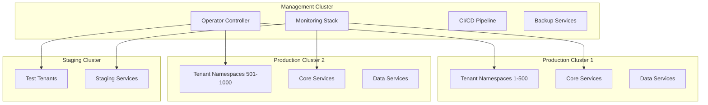

# ☸️ NeuralLog Kubernetes Guide

Comprehensive guide for managing the NeuralLog Kubernetes infrastructure, including the operator, multi-tenant architecture, and cluster operations.

## 📋 Table of Contents

- [🏗️ Cluster Architecture](#️-cluster-architecture)
- [🤖 NeuralLog Operator](#-neurallog-operator)
- [🏢 Multi-Tenant Management](#-multi-tenant-management)
- [📊 Resource Management](#-resource-management)
- [🔒 Security & RBAC](#-security--rbac)
- [🌐 Networking](#-networking)
- [💾 Storage Management](#-storage-management)
- [📈 Monitoring & Observability](#-monitoring--observability)
- [🔧 Troubleshooting](#-troubleshooting)
- [📚 Best Practices](#-best-practices)

---

## 🏗️ Cluster Architecture

### 🎯 Cluster Design

NeuralLog uses a **multi-cluster architecture** for production deployments:



### 🔧 Cluster Specifications

#### Production Cluster Requirements

| Component | Minimum | Recommended | Enterprise |
|-----------|---------|-------------|------------|
| **Nodes** | 6 | 12 | 24+ |
| **CPU per Node** | 8 cores | 16 cores | 32 cores |
| **Memory per Node** | 32 GB | 64 GB | 128 GB |
| **Storage per Node** | 500 GB SSD | 1 TB NVMe | 2 TB NVMe |
| **Network** | 10 Gbps | 25 Gbps | 100 Gbps |

#### Node Pool Configuration
```yaml
apiVersion: v1
kind: Node
metadata:
  labels:
    node-role.kubernetes.io/worker: ""
    neurallog.io/node-type: "tenant-workload"
    neurallog.io/zone: "us-west-2a"
spec:
  taints:
  - key: "neurallog.io/tenant-workload"
    value: "true"
    effect: "NoSchedule"
```

---

## 🤖 NeuralLog Operator

### 📦 Operator Installation

#### Prerequisites
```bash
# Install cert-manager (required for webhooks)
kubectl apply -f https://github.com/cert-manager/cert-manager/releases/download/v1.13.0/cert-manager.yaml

# Wait for cert-manager to be ready
kubectl wait --for=condition=ready pod -l app=cert-manager -n cert-manager --timeout=300s
```

#### Install Operator
```bash
# Clone repository
git clone https://github.com/NeuralLog/NeuralLog.git
cd NeuralLog

# Build and deploy operator
make -C infra/operators/neurallog-operator deploy IMG=neurallog/operator:v1.0.0

# Verify installation
kubectl get pods -n neurallog-operator-system
kubectl get crd tenants.neurallog.io
```

### 🔧 Operator Configuration

#### Operator Deployment
```yaml
apiVersion: apps/v1
kind: Deployment
metadata:
  name: neurallog-operator-controller-manager
  namespace: neurallog-operator-system
spec:
  replicas: 2
  selector:
    matchLabels:
      control-plane: controller-manager
  template:
    metadata:
      labels:
        control-plane: controller-manager
    spec:
      containers:
      - name: manager
        image: neurallog/operator:v1.0.0
        args:
        - --leader-elect
        - --metrics-bind-address=:8080
        - --health-probe-bind-address=:8081
        env:
        - name: WATCH_NAMESPACE
          value: ""
        - name: POD_NAME
          valueFrom:
            fieldRef:
              fieldPath: metadata.name
        - name: OPERATOR_NAME
          value: "neurallog-operator"
        resources:
          limits:
            cpu: 500m
            memory: 512Mi
          requests:
            cpu: 100m
            memory: 128Mi
        livenessProbe:
          httpGet:
            path: /healthz
            port: 8081
          initialDelaySeconds: 15
          periodSeconds: 20
        readinessProbe:
          httpGet:
            path: /readyz
            port: 8081
          initialDelaySeconds: 5
          periodSeconds: 10
```

### 📊 Custom Resource Definitions

#### Tenant CRD
```yaml
apiVersion: apiextensions.k8s.io/v1
kind: CustomResourceDefinition
metadata:
  name: tenants.neurallog.io
spec:
  group: neurallog.io
  versions:
  - name: v1
    served: true
    storage: true
    schema:
      openAPIV3Schema:
        type: object
        properties:
          spec:
            type: object
            required: ["tenantId", "planId", "billingEmail"]
            properties:
              tenantId:
                type: string
                pattern: '^[a-z0-9-]+$'
                maxLength: 63
              planId:
                type: string
                enum: ["starter", "professional", "enterprise"]
              billingEmail:
                type: string
                format: email
              resources:
                type: object
                properties:
                  cpu:
                    type: object
                    properties:
                      requests: { type: string }
                      limits: { type: string }
                  memory:
                    type: object
                    properties:
                      requests: { type: string }
                      limits: { type: string }
          status:
            type: object
            properties:
              phase:
                type: string
                enum: ["Pending", "Creating", "Active", "Updating", "Deleting", "Failed"]
              message: { type: string }
              lastUpdated: { type: string, format: date-time }
              conditions:
                type: array
                items:
                  type: object
                  properties:
                    type: { type: string }
                    status: { type: string }
                    lastTransitionTime: { type: string, format: date-time }
                    reason: { type: string }
                    message: { type: string }
  scope: Cluster
  names:
    plural: tenants
    singular: tenant
    kind: Tenant
```

---

## 🏢 Multi-Tenant Management

### 🏗️ Tenant Provisioning

#### Create Tenant
```yaml
apiVersion: neurallog.io/v1
kind: Tenant
metadata:
  name: acme-corp
  labels:
    neurallog.io/tenant-id: acme-corp
    neurallog.io/plan: professional
spec:
  tenantId: acme-corp
  planId: professional
  billingEmail: billing@acme-corp.com
  resources:
    cpu:
      requests: "4"
      limits: "8"
    memory:
      requests: "8Gi"
      limits: "16Gi"
    storage:
      requests: "50Gi"
      storageClass: fast-ssd
    pods: 25
    services: 10
  features:
    aiEnabled: true
    customMetrics: true
    realTimeAnalytics: true
  services:
    logServer:
      enabled: true
      replicas: 2
      resources:
        requests: "500m"
        limits: "1"
    authService:
      enabled: true
      replicas: 1
      resources:
        requests: "200m"
        limits: "500m"
```

#### Tenant Lifecycle Management
```bash
# Create tenant
kubectl apply -f tenant-acme-corp.yaml

# Check tenant status
kubectl get tenant acme-corp -o yaml

# Update tenant plan
kubectl patch tenant acme-corp --type='merge' -p='{"spec":{"planId":"enterprise"}}'

# Delete tenant
kubectl delete tenant acme-corp
```

### 🔍 Tenant Monitoring

#### List All Tenants
```bash
# Get all tenants with status
kubectl get tenants -o custom-columns=\
NAME:.metadata.name,\
TENANT-ID:.spec.tenantId,\
PLAN:.spec.planId,\
PHASE:.status.phase,\
AGE:.metadata.creationTimestamp

# Get tenant resource usage
kubectl get resourcequota --all-namespaces -l neurallog.io/tenant-id
```

#### Tenant Health Check
```bash
# Check specific tenant
TENANT_ID="acme-corp"
NAMESPACE="tenant-${TENANT_ID}"

# Verify namespace exists
kubectl get namespace $NAMESPACE

# Check resource quota
kubectl get resourcequota -n $NAMESPACE

# Check running pods
kubectl get pods -n $NAMESPACE

# Check services
kubectl get services -n $NAMESPACE
```

---

## 📊 Resource Management

### 💾 Resource Quotas by Plan

#### Starter Plan
```yaml
apiVersion: v1
kind: ResourceQuota
metadata:
  name: tenant-starter-quota
  namespace: tenant-example
spec:
  hard:
    requests.cpu: "2"
    requests.memory: 4Gi
    limits.cpu: "4"
    limits.memory: 8Gi
    requests.storage: 10Gi
    pods: "10"
    services: "5"
    persistentvolumeclaims: "3"
    secrets: "10"
    configmaps: "10"
```

#### Professional Plan
```yaml
apiVersion: v1
kind: ResourceQuota
metadata:
  name: tenant-professional-quota
  namespace: tenant-example
spec:
  hard:
    requests.cpu: "8"
    requests.memory: 16Gi
    limits.cpu: "16"
    limits.memory: 32Gi
    requests.storage: 100Gi
    pods: "50"
    services: "15"
    persistentvolumeclaims: "10"
    secrets: "50"
    configmaps: "50"
```

#### Enterprise Plan
```yaml
apiVersion: v1
kind: ResourceQuota
metadata:
  name: tenant-enterprise-quota
  namespace: tenant-example
spec:
  hard:
    requests.cpu: "32"
    requests.memory: 64Gi
    limits.cpu: "64"
    limits.memory: 128Gi
    requests.storage: 1Ti
    pods: "100"
    services: "20"
    persistentvolumeclaims: "25"
    secrets: "100"
    configmaps: "100"
```

### 📏 Limit Ranges

#### Container Limits
```yaml
apiVersion: v1
kind: LimitRange
metadata:
  name: tenant-container-limits
  namespace: tenant-example
spec:
  limits:
  - type: Container
    default:
      cpu: 200m
      memory: 256Mi
    defaultRequest:
      cpu: 100m
      memory: 128Mi
    max:
      cpu: "4"
      memory: 8Gi
    min:
      cpu: 50m
      memory: 64Mi
  - type: Pod
    max:
      cpu: "8"
      memory: 16Gi
  - type: PersistentVolumeClaim
    max:
      storage: 50Gi
    min:
      storage: 1Gi
```

---

## 🔒 Security & RBAC

### 🛡️ Tenant RBAC

#### Service Account
```yaml
apiVersion: v1
kind: ServiceAccount
metadata:
  name: tenant-service-account
  namespace: tenant-acme-corp
  labels:
    neurallog.io/tenant-id: acme-corp
automountServiceAccountToken: false
```

#### Role Definition
```yaml
apiVersion: rbac.authorization.k8s.io/v1
kind: Role
metadata:
  name: tenant-role
  namespace: tenant-acme-corp
rules:
- apiGroups: [""]
  resources: ["pods", "services", "configmaps", "secrets"]
  verbs: ["get", "list", "watch"]
- apiGroups: ["apps"]
  resources: ["deployments", "replicasets"]
  verbs: ["get", "list", "watch"]
- apiGroups: [""]
  resources: ["pods/log"]
  verbs: ["get", "list"]
- apiGroups: [""]
  resources: ["events"]
  verbs: ["get", "list", "watch"]
```

#### Role Binding
```yaml
apiVersion: rbac.authorization.k8s.io/v1
kind: RoleBinding
metadata:
  name: tenant-role-binding
  namespace: tenant-acme-corp
subjects:
- kind: ServiceAccount
  name: tenant-service-account
  namespace: tenant-acme-corp
roleRef:
  kind: Role
  name: tenant-role
  apiGroup: rbac.authorization.k8s.io
```

### 🔐 Pod Security Standards

#### Pod Security Policy
```yaml
apiVersion: policy/v1beta1
kind: PodSecurityPolicy
metadata:
  name: tenant-psp
spec:
  privileged: false
  allowPrivilegeEscalation: false
  requiredDropCapabilities:
    - ALL
  volumes:
    - 'configMap'
    - 'emptyDir'
    - 'projected'
    - 'secret'
    - 'downwardAPI'
    - 'persistentVolumeClaim'
  runAsUser:
    rule: 'MustRunAsNonRoot'
  seLinux:
    rule: 'RunAsAny'
  fsGroup:
    rule: 'RunAsAny'
```

---

## 🌐 Networking

### 🛡️ Network Policies

#### Tenant Isolation Policy
```yaml
apiVersion: networking.k8s.io/v1
kind: NetworkPolicy
metadata:
  name: tenant-isolation
  namespace: tenant-acme-corp
spec:
  podSelector: {}
  policyTypes:
  - Ingress
  - Egress
  ingress:
  - from:
    - namespaceSelector:
        matchLabels:
          name: tenant-acme-corp
    - namespaceSelector:
        matchLabels:
          name: neurallog-system
    - namespaceSelector:
        matchLabels:
          name: ingress-nginx
  egress:
  - to:
    - namespaceSelector:
        matchLabels:
          name: tenant-acme-corp
    - namespaceSelector:
        matchLabels:
          name: neurallog-system
  - to: []
    ports:
    - protocol: UDP
      port: 53
    - protocol: TCP
      port: 443
    - protocol: TCP
      port: 80
```

#### System Services Access
```yaml
apiVersion: networking.k8s.io/v1
kind: NetworkPolicy
metadata:
  name: allow-system-services
  namespace: tenant-acme-corp
spec:
  podSelector: {}
  policyTypes:
  - Egress
  egress:
  - to:
    - namespaceSelector:
        matchLabels:
          name: neurallog-system
    ports:
    - protocol: TCP
      port: 8080
    - protocol: TCP
      port: 5432
    - protocol: TCP
      port: 6379
```

### 🔗 Service Mesh Integration

#### Istio Configuration
```yaml
apiVersion: security.istio.io/v1beta1
kind: AuthorizationPolicy
metadata:
  name: tenant-access-control
  namespace: tenant-acme-corp
spec:
  rules:
  - from:
    - source:
        namespaces: ["tenant-acme-corp"]
  - from:
    - source:
        namespaces: ["neurallog-system"]
        principals: ["cluster.local/ns/neurallog-system/sa/billing-service"]
  - from:
    - source:
        namespaces: ["ingress-nginx"]
```

---

## 💾 Storage Management

### 📦 Storage Classes

#### Fast SSD Storage
```yaml
apiVersion: storage.k8s.io/v1
kind: StorageClass
metadata:
  name: fast-ssd
  annotations:
    storageclass.kubernetes.io/is-default-class: "false"
provisioner: kubernetes.io/aws-ebs
parameters:
  type: gp3
  iops: "3000"
  throughput: "125"
  encrypted: "true"
volumeBindingMode: WaitForFirstConsumer
allowVolumeExpansion: true
reclaimPolicy: Delete
```

#### Premium NVMe Storage
```yaml
apiVersion: storage.k8s.io/v1
kind: StorageClass
metadata:
  name: premium-nvme
provisioner: kubernetes.io/aws-ebs
parameters:
  type: io2
  iops: "10000"
  encrypted: "true"
volumeBindingMode: WaitForFirstConsumer
allowVolumeExpansion: true
reclaimPolicy: Retain
```

### 💾 Persistent Volume Management

#### Tenant Storage Template
```yaml
apiVersion: v1
kind: PersistentVolumeClaim
metadata:
  name: tenant-data-storage
  namespace: tenant-acme-corp
  labels:
    neurallog.io/tenant-id: acme-corp
    neurallog.io/storage-type: data
spec:
  accessModes:
    - ReadWriteOnce
  storageClassName: fast-ssd
  resources:
    requests:
      storage: 50Gi
```

#### Storage Monitoring
```bash
# Check PVC status
kubectl get pvc --all-namespaces -l neurallog.io/tenant-id

# Monitor storage usage
kubectl exec -it <pod-name> -- df -h

# Check storage class usage
kubectl get pv -o custom-columns=\
NAME:.metadata.name,\
CAPACITY:.spec.capacity.storage,\
STORAGECLASS:.spec.storageClassName,\
STATUS:.status.phase
```

---

## 📈 Monitoring & Observability

### 📊 Operator Metrics

#### Prometheus Metrics
```yaml
# Tenant creation rate
neurallog_operator_tenants_created_total

# Tenant reconciliation duration
neurallog_operator_reconcile_duration_seconds

# Active tenants by plan
neurallog_operator_active_tenants{plan="professional"}

# Resource quota utilization
neurallog_operator_resource_quota_utilization{tenant="acme-corp",resource="cpu"}
```

#### Grafana Dashboard Queries
```promql
# Tenant creation rate
rate(neurallog_operator_tenants_created_total[5m])

# Average reconciliation time
avg(neurallog_operator_reconcile_duration_seconds)

# Tenant resource utilization
(
  neurallog_operator_resource_quota_used{resource="cpu"} /
  neurallog_operator_resource_quota_limit{resource="cpu"}
) * 100
```

### 🔍 Logging

#### Operator Logs
```bash
# View operator logs
kubectl logs -f deployment/neurallog-operator-controller-manager \
  -n neurallog-operator-system

# Filter for specific tenant
kubectl logs deployment/neurallog-operator-controller-manager \
  -n neurallog-operator-system | grep "tenant=acme-corp"

# Check for errors
kubectl logs deployment/neurallog-operator-controller-manager \
  -n neurallog-operator-system | grep ERROR
```

#### Tenant Logs
```bash
# View all logs for a tenant
kubectl logs --all-containers=true -l neurallog.io/tenant-id=acme-corp \
  -n tenant-acme-corp

# Stream logs from specific service
kubectl logs -f deployment/log-server -n tenant-acme-corp
```

---

## 🔧 Troubleshooting

### 🚨 Common Issues

#### Tenant Creation Stuck
```bash
# Check tenant status
kubectl describe tenant acme-corp

# Check operator logs
kubectl logs deployment/neurallog-operator-controller-manager \
  -n neurallog-operator-system | grep "tenant=acme-corp"

# Check for resource constraints
kubectl describe nodes | grep -A 5 "Allocated resources"

# Force reconciliation
kubectl annotate tenant acme-corp neurallog.io/force-reconcile="$(date)"
```

#### Resource Quota Exceeded
```bash
# Check current usage
kubectl describe resourcequota -n tenant-acme-corp

# Check pod resource requests
kubectl get pods -n tenant-acme-corp -o custom-columns=\
NAME:.metadata.name,\
CPU-REQ:.spec.containers[*].resources.requests.cpu,\
MEM-REQ:.spec.containers[*].resources.requests.memory

# Scale down if necessary
kubectl scale deployment/log-server --replicas=1 -n tenant-acme-corp
```

#### Network Policy Issues
```bash
# Test connectivity
kubectl exec -it <pod-name> -n tenant-acme-corp -- \
  curl -v http://billing-service.neurallog-system:8080/health

# Check network policies
kubectl get networkpolicy -n tenant-acme-corp

# Describe network policy
kubectl describe networkpolicy tenant-isolation -n tenant-acme-corp
```

### 🔍 Debugging Commands

#### Operator Debugging
```bash
# Enable debug logging
kubectl patch deployment neurallog-operator-controller-manager \
  -n neurallog-operator-system \
  -p '{"spec":{"template":{"spec":{"containers":[{"name":"manager","args":["--leader-elect","--zap-log-level=debug"]}]}}}}'

# Check operator metrics
kubectl port-forward deployment/neurallog-operator-controller-manager 8080:8080 \
  -n neurallog-operator-system &
curl http://localhost:8080/metrics | grep neurallog_operator
```

#### Tenant Debugging
```bash
# Get tenant events
kubectl get events -n tenant-acme-corp --sort-by='.lastTimestamp'

# Check pod status
kubectl get pods -n tenant-acme-corp -o wide

# Describe problematic pod
kubectl describe pod <pod-name> -n tenant-acme-corp

# Check resource usage
kubectl top pods -n tenant-acme-corp
```

---

## 📚 Best Practices

### 🎯 Operator Best Practices

1. **Resource Limits**: Always set resource limits for the operator
2. **High Availability**: Run multiple operator replicas
3. **Monitoring**: Monitor operator metrics and logs
4. **Backup**: Backup CRDs and operator configuration
5. **Testing**: Test operator upgrades in staging first

### 🏢 Multi-Tenancy Best Practices

1. **Namespace Isolation**: Use dedicated namespaces per tenant
2. **Resource Quotas**: Enforce resource limits per tenant
3. **Network Policies**: Implement strict network isolation
4. **RBAC**: Use least-privilege access controls
5. **Monitoring**: Monitor per-tenant resource usage

### 🔒 Security Best Practices

1. **Pod Security**: Use Pod Security Standards
2. **Service Accounts**: Use dedicated service accounts
3. **Secrets Management**: Use external secret management
4. **Network Security**: Implement network policies
5. **Image Security**: Scan container images for vulnerabilities

### 📊 Performance Best Practices

1. **Resource Planning**: Plan resource allocation carefully
2. **Node Affinity**: Use node affinity for workload placement
3. **Storage**: Use appropriate storage classes
4. **Monitoring**: Monitor cluster and tenant performance
5. **Scaling**: Implement horizontal pod autoscaling

---

This Kubernetes guide provides comprehensive coverage of managing the NeuralLog platform on Kubernetes. For additional details on specific components, refer to the individual service documentation and the [Operations Manual](OPERATIONS.md).
