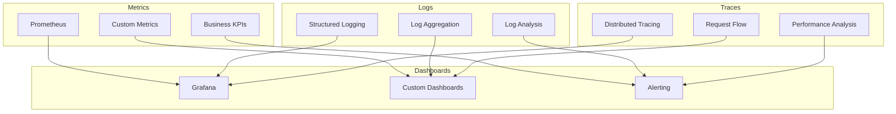

# 📊 NeuralLog Monitoring & Observability

Comprehensive guide for monitoring, alerting, and observability in the NeuralLog platform using Prometheus, Grafana, and distributed tracing.

## 📋 Table of Contents

- [🎯 Monitoring Strategy](#-monitoring-strategy)
- [📈 Prometheus Configuration](#-prometheus-configuration)
- [📊 Grafana Dashboards](#-grafana-dashboards)
- [🚨 Alerting & Notifications](#-alerting--notifications)
- [🔍 Distributed Tracing](#-distributed-tracing)
- [📋 Log Aggregation](#-log-aggregation)
- [📊 Business Metrics](#-business-metrics)
- [🔧 Troubleshooting](#-troubleshooting)
- [📚 Best Practices](#-best-practices)

---

## 🎯 Monitoring Strategy

### 📊 Observability Pillars

NeuralLog implements comprehensive observability across three pillars:



### 🎯 Monitoring Objectives

#### Service Level Objectives (SLOs)
- **API Availability**: 99.9% uptime
- **Response Time**: p95 < 100ms for critical APIs
- **Error Rate**: < 0.1% for user-facing operations
- **Data Durability**: 99.999999999% (11 9's)

#### Key Performance Indicators (KPIs)
- **Business Metrics**: Revenue, churn, growth
- **Operational Metrics**: Uptime, performance, errors
- **User Experience**: Response times, success rates
- **Resource Utilization**: CPU, memory, storage

---

## 📈 Prometheus Configuration

### 🔧 Prometheus Setup

#### Core Configuration
```yaml
global:
  scrape_interval: 15s
  evaluation_interval: 15s
  external_labels:
    cluster: 'neurallog-production'
    environment: 'production'

rule_files:
  - "/etc/prometheus/rules/*.yml"

alerting:
  alertmanagers:
    - static_configs:
        - targets:
          - alertmanager:9093

scrape_configs:
  # Kubernetes API server
  - job_name: 'kubernetes-apiservers'
    kubernetes_sd_configs:
      - role: endpoints
    scheme: https
    tls_config:
      ca_file: /var/run/secrets/kubernetes.io/serviceaccount/ca.crt
    bearer_token_file: /var/run/secrets/kubernetes.io/serviceaccount/token
    relabel_configs:
      - source_labels: [__meta_kubernetes_namespace, __meta_kubernetes_service_name, __meta_kubernetes_endpoint_port_name]
        action: keep
        regex: default;kubernetes;https

  # NeuralLog services
  - job_name: 'neurallog-services'
    kubernetes_sd_configs:
      - role: endpoints
        namespaces:
          names:
            - neurallog-system
    relabel_configs:
      - source_labels: [__meta_kubernetes_service_annotation_prometheus_io_scrape]
        action: keep
        regex: true
      - source_labels: [__meta_kubernetes_service_annotation_prometheus_io_path]
        action: replace
        target_label: __metrics_path__
        regex: (.+)
```

### 📊 Custom Metrics

#### Application Metrics
```javascript
// Node.js service metrics
const promClient = require('prom-client');

// HTTP request metrics
const httpRequestDuration = new promClient.Histogram({
  name: 'http_request_duration_seconds',
  help: 'Duration of HTTP requests in seconds',
  labelNames: ['method', 'route', 'status_code', 'tenant_id'],
  buckets: [0.001, 0.005, 0.01, 0.05, 0.1, 0.5, 1, 5]
});

// Business metrics
const logsIngested = new promClient.Counter({
  name: 'neurallog_logs_ingested_total',
  help: 'Total number of logs ingested',
  labelNames: ['tenant_id', 'level', 'source']
});

const activeUsers = new promClient.Gauge({
  name: 'neurallog_active_users',
  help: 'Number of active users',
  labelNames: ['tenant_id', 'time_window']
});

// Usage metrics
const storageUsed = new promClient.Gauge({
  name: 'neurallog_storage_bytes_used',
  help: 'Storage used in bytes',
  labelNames: ['tenant_id', 'storage_type']
});
```

#### Kubernetes Metrics
```yaml
# ServiceMonitor for automatic discovery
apiVersion: monitoring.coreos.com/v1
kind: ServiceMonitor
metadata:
  name: neurallog-services
  namespace: neurallog-system
spec:
  selector:
    matchLabels:
      app.kubernetes.io/part-of: neurallog
  endpoints:
  - port: metrics
    interval: 30s
    path: /metrics
    honorLabels: true
```

### 🎯 Recording Rules

#### Performance Rules
```yaml
groups:
- name: neurallog.performance.rules
  rules:
  # API latency percentiles
  - record: neurallog:api_latency_p50
    expr: histogram_quantile(0.50, rate(http_request_duration_seconds_bucket{job=~"neurallog-.*"}[5m]))
  
  - record: neurallog:api_latency_p95
    expr: histogram_quantile(0.95, rate(http_request_duration_seconds_bucket{job=~"neurallog-.*"}[5m]))
  
  - record: neurallog:api_latency_p99
    expr: histogram_quantile(0.99, rate(http_request_duration_seconds_bucket{job=~"neurallog-.*"}[5m]))

  # Error rates
  - record: neurallog:api_error_rate
    expr: |
      (
        rate(http_requests_total{job=~"neurallog-.*",status=~"5.."}[5m]) /
        rate(http_requests_total{job=~"neurallog-.*"}[5m])
      ) * 100

  # Availability
  - record: neurallog:api_availability
    expr: |
      (
        rate(http_requests_total{job=~"neurallog-.*"}[5m]) -
        rate(http_requests_total{job=~"neurallog-.*",status=~"5.."}[5m])
      ) /
      rate(http_requests_total{job=~"neurallog-.*"}[5m]) * 100
```

#### Business Rules
```yaml
groups:
- name: neurallog.business.rules
  rules:
  # Tenant metrics
  - record: neurallog:tenant_log_rate_5m
    expr: rate(neurallog_logs_ingested_total[5m])
  
  - record: neurallog:tenant_monthly_logs
    expr: increase(neurallog_logs_ingested_total[30d])
  
  - record: neurallog:tenant_storage_growth_rate
    expr: rate(neurallog_storage_bytes_used[1h])

  # Revenue metrics
  - record: neurallog:monthly_recurring_revenue
    expr: sum(neurallog_subscription_value) by (plan)
  
  - record: neurallog:average_revenue_per_user
    expr: neurallog:monthly_recurring_revenue / count(neurallog_active_tenants)
```

---

## 📊 Grafana Dashboards

### 🎯 System Overview Dashboard

#### Key Panels
```json
{
  "dashboard": {
    "title": "NeuralLog System Overview",
    "panels": [
      {
        "title": "Service Availability",
        "type": "stat",
        "targets": [
          {
            "expr": "neurallog:api_availability",
            "legendFormat": "{{service}}"
          }
        ],
        "thresholds": [
          {"color": "red", "value": 99.0},
          {"color": "yellow", "value": 99.5},
          {"color": "green", "value": 99.9}
        ]
      },
      {
        "title": "Request Rate",
        "type": "graph",
        "targets": [
          {
            "expr": "sum(rate(http_requests_total{job=~\"neurallog-.*\"}[5m])) by (service)",
            "legendFormat": "{{service}}"
          }
        ]
      },
      {
        "title": "Response Time",
        "type": "graph",
        "targets": [
          {
            "expr": "neurallog:api_latency_p50",
            "legendFormat": "p50"
          },
          {
            "expr": "neurallog:api_latency_p95",
            "legendFormat": "p95"
          },
          {
            "expr": "neurallog:api_latency_p99",
            "legendFormat": "p99"
          }
        ]
      }
    ]
  }
}
```

### 🏢 Tenant Dashboard

#### Tenant Metrics
```json
{
  "dashboard": {
    "title": "Tenant Metrics",
    "templating": {
      "list": [
        {
          "name": "tenant",
          "type": "query",
          "query": "label_values(neurallog_logs_ingested_total, tenant_id)"
        }
      ]
    },
    "panels": [
      {
        "title": "Log Ingestion Rate",
        "type": "graph",
        "targets": [
          {
            "expr": "rate(neurallog_logs_ingested_total{tenant_id=\"$tenant\"}[5m])",
            "legendFormat": "{{level}}"
          }
        ]
      },
      {
        "title": "Storage Usage",
        "type": "graph",
        "targets": [
          {
            "expr": "neurallog_storage_bytes_used{tenant_id=\"$tenant\"}",
            "legendFormat": "{{storage_type}}"
          }
        ]
      },
      {
        "title": "Resource Utilization",
        "type": "graph",
        "targets": [
          {
            "expr": "rate(container_cpu_usage_seconds_total{namespace=\"tenant-$tenant\"}[5m]) * 100",
            "legendFormat": "CPU %"
          },
          {
            "expr": "container_memory_usage_bytes{namespace=\"tenant-$tenant\"} / container_spec_memory_limit_bytes * 100",
            "legendFormat": "Memory %"
          }
        ]
      }
    ]
  }
}
```

### 💰 Business Dashboard

#### Revenue Metrics
```json
{
  "dashboard": {
    "title": "Business Metrics",
    "panels": [
      {
        "title": "Monthly Recurring Revenue",
        "type": "stat",
        "targets": [
          {
            "expr": "neurallog:monthly_recurring_revenue",
            "legendFormat": "MRR"
          }
        ]
      },
      {
        "title": "Active Tenants by Plan",
        "type": "piechart",
        "targets": [
          {
            "expr": "count(neurallog_active_tenants) by (plan)",
            "legendFormat": "{{plan}}"
          }
        ]
      },
      {
        "title": "Usage Growth",
        "type": "graph",
        "targets": [
          {
            "expr": "increase(neurallog_logs_ingested_total[1d])",
            "legendFormat": "Daily Logs"
          }
        ]
      }
    ]
  }
}
```

---

## 🚨 Alerting & Notifications

### 🔔 Alert Rules

#### Critical Alerts
```yaml
groups:
- name: neurallog.critical.alerts
  rules:
  # Service down
  - alert: ServiceDown
    expr: up{job=~"neurallog-.*"} == 0
    for: 1m
    labels:
      severity: critical
      team: sre
      page: true
    annotations:
      summary: "NeuralLog service {{ $labels.job }} is down"
      description: "Service {{ $labels.job }} has been down for more than 1 minute"
      runbook_url: "https://docs.neurallog.com/runbooks/service-down"

  # High error rate
  - alert: HighErrorRate
    expr: neurallog:api_error_rate > 5
    for: 5m
    labels:
      severity: critical
      team: sre
      page: true
    annotations:
      summary: "High error rate detected"
      description: "Error rate is {{ $value }}% for the last 5 minutes"

  # API latency high
  - alert: HighAPILatency
    expr: neurallog:api_latency_p95 > 0.5
    for: 10m
    labels:
      severity: critical
      team: sre
    annotations:
      summary: "High API latency detected"
      description: "95th percentile latency is {{ $value }}s"
```

#### Warning Alerts
```yaml
groups:
- name: neurallog.warning.alerts
  rules:
  # Resource usage high
  - alert: HighCPUUsage
    expr: rate(container_cpu_usage_seconds_total[5m]) * 100 > 80
    for: 15m
    labels:
      severity: warning
      team: sre
    annotations:
      summary: "High CPU usage detected"
      description: "CPU usage is {{ $value }}% for {{ $labels.pod }}"

  # Memory usage high
  - alert: HighMemoryUsage
    expr: container_memory_usage_bytes / container_spec_memory_limit_bytes * 100 > 85
    for: 10m
    labels:
      severity: warning
      team: sre
    annotations:
      summary: "High memory usage detected"
      description: "Memory usage is {{ $value }}% for {{ $labels.pod }}"

  # Disk space low
  - alert: LowDiskSpace
    expr: (node_filesystem_avail_bytes / node_filesystem_size_bytes) * 100 < 15
    for: 5m
    labels:
      severity: warning
      team: sre
    annotations:
      summary: "Low disk space"
      description: "Disk space is {{ $value }}% available on {{ $labels.instance }}"
```

### 📱 Notification Channels

#### AlertManager Configuration
```yaml
global:
  smtp_smarthost: 'smtp.gmail.com:587'
  smtp_from: 'alerts@neurallog.com'

route:
  group_by: ['alertname', 'cluster', 'service']
  group_wait: 10s
  group_interval: 10s
  repeat_interval: 1h
  receiver: 'default'
  routes:
  - match:
      severity: critical
    receiver: 'critical-alerts'
  - match:
      team: sre
    receiver: 'sre-team'

receivers:
- name: 'default'
  email_configs:
  - to: 'team@neurallog.com'
    subject: 'NeuralLog Alert: {{ .GroupLabels.alertname }}'
    body: |
      {{ range .Alerts }}
      Alert: {{ .Annotations.summary }}
      Description: {{ .Annotations.description }}
      {{ end }}

- name: 'critical-alerts'
  pagerduty_configs:
  - service_key: 'YOUR_PAGERDUTY_SERVICE_KEY'
    description: '{{ .GroupLabels.alertname }}: {{ .CommonAnnotations.summary }}'
  slack_configs:
  - api_url: 'YOUR_SLACK_WEBHOOK_URL'
    channel: '#critical-alerts'
    title: 'Critical Alert: {{ .GroupLabels.alertname }}'
    text: '{{ .CommonAnnotations.description }}'

- name: 'sre-team'
  slack_configs:
  - api_url: 'YOUR_SLACK_WEBHOOK_URL'
    channel: '#sre-alerts'
    title: 'SRE Alert: {{ .GroupLabels.alertname }}'
    text: '{{ .CommonAnnotations.description }}'
```

---

## 🔍 Distributed Tracing

### 🔗 Jaeger Configuration

#### Tracing Setup
```yaml
apiVersion: apps/v1
kind: Deployment
metadata:
  name: jaeger
  namespace: neurallog-monitoring
spec:
  replicas: 1
  selector:
    matchLabels:
      app: jaeger
  template:
    metadata:
      labels:
        app: jaeger
    spec:
      containers:
      - name: jaeger
        image: jaegertracing/all-in-one:1.50
        ports:
        - containerPort: 16686
          name: ui
        - containerPort: 14268
          name: collector
        env:
        - name: COLLECTOR_OTLP_ENABLED
          value: "true"
        - name: SPAN_STORAGE_TYPE
          value: "elasticsearch"
        - name: ES_SERVER_URLS
          value: "http://elasticsearch:9200"
```

#### Application Instrumentation
```javascript
// Node.js OpenTelemetry setup
const { NodeSDK } = require('@opentelemetry/sdk-node');
const { getNodeAutoInstrumentations } = require('@opentelemetry/auto-instrumentations-node');
const { JaegerExporter } = require('@opentelemetry/exporter-jaeger');

const jaegerExporter = new JaegerExporter({
  endpoint: 'http://jaeger:14268/api/traces',
});

const sdk = new NodeSDK({
  traceExporter: jaegerExporter,
  instrumentations: [getNodeAutoInstrumentations()],
  serviceName: 'neurallog-billing-service',
  serviceVersion: '1.0.0',
});

sdk.start();

// Custom span creation
const opentelemetry = require('@opentelemetry/api');

function processLogBatch(logs) {
  const span = opentelemetry.trace.getActiveSpan();
  span.setAttributes({
    'log.count': logs.length,
    'tenant.id': logs[0].tenantId
  });
  
  // Process logs...
  
  span.setStatus({ code: opentelemetry.SpanStatusCode.OK });
}
```

---

## 📋 Log Aggregation

### 📊 Structured Logging

#### Log Format Standard
```json
{
  "timestamp": "2024-01-15T10:30:00.000Z",
  "level": "info",
  "service": "billing-service",
  "version": "1.2.0",
  "message": "Processing billing calculation",
  "tenantId": "acme-corp",
  "userId": "user_12345",
  "requestId": "req_abc123",
  "duration": 150,
  "metadata": {
    "subscriptionId": "sub_789",
    "amount": 9900,
    "currency": "usd"
  },
  "labels": {
    "environment": "production",
    "cluster": "us-west-2",
    "namespace": "neurallog-system"
  }
}
```

#### Fluentd Configuration
```yaml
apiVersion: v1
kind: ConfigMap
metadata:
  name: fluentd-config
  namespace: neurallog-monitoring
data:
  fluent.conf: |
    <source>
      @type tail
      path /var/log/containers/*.log
      pos_file /var/log/fluentd-containers.log.pos
      tag kubernetes.*
      format json
      read_from_head true
    </source>
    
    <filter kubernetes.**>
      @type kubernetes_metadata
    </filter>
    
    <filter kubernetes.**>
      @type grep
      <regexp>
        key $.kubernetes.namespace_name
        pattern ^(neurallog-system|tenant-.*)$
      </regexp>
    </filter>
    
    <match kubernetes.**>
      @type elasticsearch
      host elasticsearch.neurallog-monitoring.svc.cluster.local
      port 9200
      index_name neurallog-logs
      type_name _doc
    </match>
```

---

## 📊 Business Metrics

### 💰 Revenue Tracking

#### Subscription Metrics
```promql
# Monthly Recurring Revenue
sum(neurallog_subscription_value{status="active"}) by (plan)

# Customer Lifetime Value
avg(neurallog_customer_lifetime_value) by (plan)

# Churn Rate
(
  sum(increase(neurallog_subscription_cancelled_total[30d])) /
  sum(neurallog_active_subscriptions)
) * 100
```

#### Usage Metrics
```promql
# Logs per tenant per day
sum(increase(neurallog_logs_ingested_total[1d])) by (tenant_id)

# Storage growth rate
rate(neurallog_storage_bytes_used[1h]) * 3600 * 24

# API usage by endpoint
sum(rate(http_requests_total{job="neurallog-api"}[5m])) by (endpoint)
```

### 📈 Growth Metrics

#### User Engagement
```promql
# Daily Active Users
count(increase(neurallog_user_sessions_total[1d]) > 0) by (tenant_id)

# Feature Adoption
sum(neurallog_feature_usage_total{feature="ai_analytics"}) /
sum(neurallog_active_users) * 100

# Query Volume Growth
rate(neurallog_queries_total[7d]) / rate(neurallog_queries_total[7d] offset 7d) - 1
```

---

## 🔧 Troubleshooting

### 🚨 Common Monitoring Issues

#### Missing Metrics
```bash
# Check service discovery
kubectl get servicemonitor -n neurallog-system

# Verify metrics endpoint
kubectl exec -it <pod-name> -- curl http://localhost:8080/metrics

# Check Prometheus targets
curl http://prometheus:9090/api/v1/targets
```

#### High Cardinality
```bash
# Check metric cardinality
curl -s http://prometheus:9090/api/v1/label/__name__/values | \
  jq -r '.data[]' | wc -l

# Find high cardinality metrics
curl -s http://prometheus:9090/api/v1/query?query=prometheus_tsdb_symbol_table_size_bytes
```

#### Dashboard Issues
```bash
# Check Grafana logs
kubectl logs deployment/grafana -n neurallog-monitoring

# Verify data source connectivity
curl -H "Authorization: Bearer $GRAFANA_TOKEN" \
  http://grafana:3000/api/datasources/proxy/1/api/v1/query?query=up
```

---

## 📚 Best Practices

### 🎯 Monitoring Best Practices

1. **Golden Signals**: Focus on latency, traffic, errors, and saturation
2. **SLI/SLO**: Define clear Service Level Indicators and Objectives
3. **Alerting**: Alert on symptoms, not causes
4. **Dashboards**: Create role-specific dashboards
5. **Documentation**: Document all metrics and alerts

### 📊 Metrics Best Practices

1. **Naming**: Use consistent metric naming conventions
2. **Labels**: Keep label cardinality low
3. **Histograms**: Use appropriate bucket sizes
4. **Recording Rules**: Pre-compute expensive queries
5. **Retention**: Set appropriate retention policies

### 🚨 Alerting Best Practices

1. **Actionable**: Every alert should be actionable
2. **Severity**: Use appropriate severity levels
3. **Runbooks**: Provide clear runbook links
4. **Escalation**: Define clear escalation paths
5. **Testing**: Regularly test alert conditions

---

This monitoring guide provides comprehensive coverage of observability in the NeuralLog platform. For specific implementation details, refer to the [Operations Manual](OPERATIONS.md) and [Troubleshooting Guide](TROUBLESHOOTING.md).
