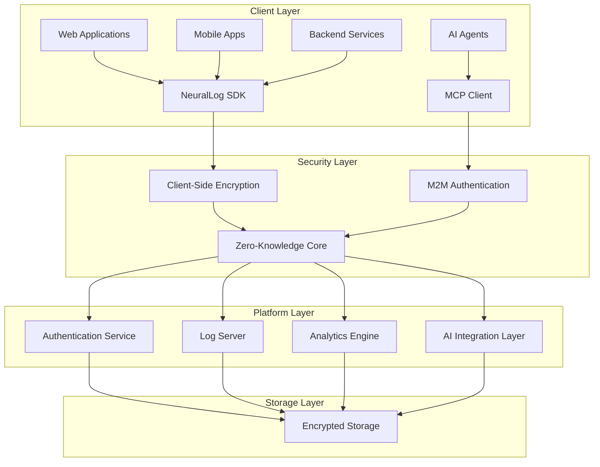

# NeuralLog Platform Overview

## 🎯 What is NeuralLog?

NeuralLog is a comprehensive zero-knowledge telemetry and logging platform that combines enterprise-grade security with cutting-edge AI integration. Built for modern applications, it provides secure data collection, intelligent analysis, and AI-powered automation while ensuring your sensitive data never leaves your control.

## 🔑 Key Value Propositions

### 🔐 Zero-Knowledge Security
- **Client-side encryption**: All data encrypted before transmission
- **No plaintext access**: Even NeuralLog operators cannot see your data
- **Compliance ready**: GDPR, CCPA, SOC 2 compliant by design
- **Audit trails**: Comprehensive logging of all access and operations

### 🤖 AI-Powered Intelligence
- **Native AI integration**: Direct integration with Claude, ChatGPT, and custom agents
- **Model Context Protocol (MCP)**: Industry-standard AI agent connectivity
- **Intelligent analysis**: AI-powered pattern detection and anomaly identification
- **Automated responses**: AI-driven incident response and alerting

### 🏢 Enterprise-Ready
- **Multi-tenant architecture**: Complete isolation between organizations
- **Scalable infrastructure**: Kubernetes-native with auto-scaling
- **High availability**: 99.9% uptime SLA with multi-region support
- **Professional support**: 24/7 enterprise support available

### 🛠️ Developer-First
- **Multiple SDKs**: TypeScript, Python, Unity, Go, Java, C#
- **Comprehensive APIs**: REST, GraphQL, and WebSocket support
- **Easy integration**: Simple setup with extensive documentation
- **Local development**: Docker-based local environment

## 🏗️ Architecture Overview



## 🚀 Core Features

### 📊 Logging & Telemetry
- **Real-time ingestion**: High-throughput data collection
- **Structured logging**: JSON-based log format with metadata
- **Custom metrics**: Define and track business-specific metrics
- **Time-series data**: Efficient storage and querying
- **Data retention**: Configurable retention policies

### 🔍 Search & Analytics
- **Searchable encryption**: Query encrypted data without decryption
- **Advanced filtering**: Complex queries across multiple dimensions
- **Real-time dashboards**: Live monitoring with customizable views
- **Pattern detection**: AI-powered identification of trends
- **Custom visualizations**: Flexible charting and reporting

### 🤖 AI Integration
- **MCP Protocol**: Native support for AI agent integration
- **Claude Desktop**: Direct integration with Anthropic's Claude
- **Custom agents**: SDK for building custom AI integrations
- **Intelligent alerting**: AI-powered alert prioritization
- **Automated analysis**: AI-driven log analysis and insights

### 🔐 Security & Privacy
- **Zero-knowledge architecture**: Data encrypted with client-controlled keys
- **Multi-tenant isolation**: Complete separation between tenants
- **Role-based access control**: Fine-grained permissions
- **Audit logging**: Comprehensive audit trails for compliance
- **Data sovereignty**: Control over data location and processing

## 🎯 Use Cases

### 🏢 Enterprise Monitoring
- **Application performance monitoring**: Track application health
- **Infrastructure monitoring**: Monitor servers and cloud resources
- **Security monitoring**: Detect and respond to security incidents
- **Compliance logging**: Maintain audit trails for regulations

### 🤖 AI-Powered Operations
- **Intelligent incident response**: AI agents automatically respond to issues
- **Predictive analytics**: AI-powered prediction of system failures
- **Automated troubleshooting**: AI agents diagnose and resolve problems
- **Smart alerting**: AI-driven alert correlation and prioritization

### 🛠️ Development & DevOps
- **Application debugging**: Detailed logging for troubleshooting
- **Performance optimization**: Identify bottlenecks and opportunities
- **Deployment monitoring**: Track deployment success and rollbacks
- **Feature flag analytics**: Monitor feature adoption and performance

### 📈 Business Intelligence
- **User behavior analytics**: Track user interactions and journeys
- **Business metrics**: Monitor KPIs and business-critical metrics
- **A/B testing**: Analyze experiment results and user segments
- **Revenue tracking**: Monitor financial metrics and trends

## 🛠️ Technology Stack

### Frontend
- **Next.js 14**: React-based web application
- **TypeScript**: Type-safe development
- **Tailwind CSS**: Utility-first CSS framework
- **Shadcn/ui**: Modern component library

### Backend
- **Node.js**: JavaScript runtime
- **TypeScript**: Type-safe backend development
- **Express.js**: Web application framework
- **OpenAPI**: API documentation and validation

### Authentication & Authorization
- **Auth0**: Identity provider integration
- **OpenFGA**: Fine-grained authorization
- **JWT**: Token-based authentication
- **OAuth2**: Standard authentication protocol

### Data Storage
- **PostgreSQL**: Primary database
- **Redis**: Caching and session storage
- **Object Storage**: File and blob storage
- **Time-series DB**: Optimized for time-based data

### Infrastructure
- **Kubernetes**: Container orchestration
- **Docker**: Containerization
- **Terraform**: Infrastructure as code
- **Helm**: Kubernetes package management

### AI Integration
- **Model Context Protocol (MCP)**: AI agent connectivity
- **OpenAI API**: GPT model integration
- **Anthropic Claude**: Claude model integration
- **Custom ML models**: Support for custom AI models

## 📦 SDK Ecosystem

### Client SDKs
- **TypeScript/JavaScript**: `@neurallog/client-sdk`
- **Python**: `neurallog-python`
- **Unity**: Unity Package Manager
- **Go**: `github.com/neurallog/go-sdk`
- **Java**: Maven/Gradle packages
- **C#**: NuGet package

### Specialized SDKs
- **MCP Client**: `@neurallog/mcp-client` - AI agent integration
- **Auth Client**: `@neurallog/auth-client` - Authentication helpers
- **TypeScript Logger**: `@neurallog/typescript-logger` - Lightweight logging

## 🚀 Getting Started

### 1. Quick Setup
```bash
git clone https://github.com/NeuralLog/NeuralLog.git
cd NeuralLog
docker-compose up -d
open http://localhost:3000
```

### 2. SDK Integration
```typescript
import { NeuralLog } from '@neurallog/client-sdk';

const logger = new NeuralLog({
  apiKey: 'your-api-key',
  tenantId: 'your-tenant-id',
  encryption: { enabled: true }
});

await logger.log({
  level: 'info',
  message: 'User action completed',
  metadata: { userId: '12345' }
});
```

### 3. AI Agent Setup
```json
{
  "mcpServers": {
    "neurallog": {
      "command": "neurallog-mcp-client",
      "env": {
        "WEB_SERVER_URL": "https://your-instance.com",
        "AUTH_CLIENT_ID": "your-client-id",
        "AUTH_CLIENT_SECRET": "your-secret",
        "TENANT_ID": "your-tenant-id"
      }
    }
  }
}
```

## 📈 Roadmap

### Current (Q1 2024)
- ✅ Zero-knowledge architecture
- ✅ Multi-tenant support
- ✅ AI agent integration (Claude)
- ✅ Comprehensive SDK suite
- ✅ Enterprise security features

### Near-term (Q2 2024)
- 🔄 ChatGPT integration
- 🔄 Advanced analytics dashboard
- 🔄 Mobile SDKs (iOS/Android)
- 🔄 Enhanced AI capabilities
- 🔄 SOC 2 Type II certification

### Future (Q3-Q4 2024)
- 📋 Custom AI model support
- 📋 Advanced compliance features
- 📋 Multi-region deployment
- 📋 Edge computing support
- 📋 Advanced visualization tools

## 🤝 Community & Support

### Open Source
- **GitHub**: [NeuralLog/NeuralLog](https://github.com/NeuralLog/NeuralLog)
- **License**: MIT License
- **Contributing**: Welcome contributions from the community

### Support Channels
- **Documentation**: [docs.neurallog.com](https://docs.neurallog.com)
- **Community**: [GitHub Discussions](https://github.com/NeuralLog/NeuralLog/discussions)
- **Issues**: [GitHub Issues](https://github.com/NeuralLog/NeuralLog/issues)
- **Enterprise**: [enterprise@neurallog.com](mailto:enterprise@neurallog.com)

---

**Ready to get started?** Check out our [Quick Start Guide](./quick-start.md) or [AI Agents Documentation](./agents.md)!
