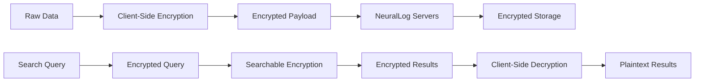

# NeuralLog Security Guide

## 🔐 Security Overview

NeuralLog is built with security as a foundational principle, implementing a comprehensive zero-knowledge architecture that ensures your sensitive data remains private and secure. This guide covers all aspects of NeuralLog's security model and best practices for secure implementation.

## 🏗️ Zero-Knowledge Architecture

### Core Principles

1. **Client-Side Encryption**: All sensitive data is encrypted on the client before transmission
2. **No Plaintext Access**: NeuralLog servers never have access to unencrypted data
3. **Key Sovereignty**: You control all encryption keys
4. **Minimal Data Collection**: Only necessary metadata is collected
5. **Audit Transparency**: All operations are logged and auditable

### Encryption Flow



## 🔑 Authentication & Authorization

### Authentication Methods

#### 1. API Key Authentication
```http
Authorization: Bearer nl_1234567890abcdef
X-Tenant-ID: tenant_abc123
```

**Best Practices:**
- Store API keys in secure environment variables
- Rotate keys regularly (recommended: every 90 days)
- Use different keys for different environments
- Monitor key usage and set up alerts for unusual activity

#### 2. Machine-to-Machine (M2M) Authentication
```http
Authorization: Bearer jwt-token
X-Tenant-ID: tenant_abc123
```

**Features:**
- JWT tokens with configurable expiration
- Automatic token refresh
- Scoped permissions
- Audit logging of all authentication events

#### 3. OAuth2 Integration
- Support for standard OAuth2 flows
- Integration with Auth0, Okta, and other providers
- PKCE support for public clients
- Refresh token rotation

### Authorization Model

#### Role-Based Access Control (RBAC)
```json
{
  "roles": {
    "admin": {
      "permissions": ["*"]
    },
    "developer": {
      "permissions": [
        "logs:read",
        "logs:write",
        "search:read",
        "metrics:read"
      ]
    },
    "viewer": {
      "permissions": [
        "logs:read",
        "search:read",
        "metrics:read"
      ]
    }
  }
}
```

#### Fine-Grained Authorization (OpenFGA)
```yaml
model: |
  model
    schema 1.1

  type user

  type tenant
    relations
      define admin: [user]
      define member: [user]
      define viewer: [user]

  type log
    relations
      define tenant: [tenant]
      define reader: admin from tenant or member from tenant or viewer from tenant
      define writer: admin from tenant or member from tenant
```

## 🛡️ Data Protection

### Encryption Standards

#### At Rest
- **Algorithm**: AES-256-GCM
- **Key Management**: Client-controlled keys with optional HSM support
- **Storage**: Encrypted database fields and file storage
- **Backup**: Encrypted backups with separate key management

#### In Transit
- **TLS 1.3**: All communications encrypted with TLS 1.3
- **Certificate Pinning**: Optional certificate pinning for enhanced security
- **HSTS**: HTTP Strict Transport Security enabled
- **Perfect Forward Secrecy**: Ephemeral key exchange

#### In Processing
- **Memory Protection**: Sensitive data cleared from memory after use
- **Secure Enclaves**: Optional support for Intel SGX and ARM TrustZone
- **Homomorphic Encryption**: Limited support for computation on encrypted data

### Key Management

#### Client-Side Key Management
```typescript
import { NeuralLog, KeyManager } from '@neurallog/client-sdk';

// Generate encryption key
const keyManager = new KeyManager();
const encryptionKey = await keyManager.generateKey({
  algorithm: 'AES-256-GCM',
  extractable: false
});

// Initialize with encryption
const logger = new NeuralLog({
  apiKey: 'your-api-key',
  tenantId: 'your-tenant-id',
  encryption: {
    enabled: true,
    key: encryptionKey,
    algorithm: 'AES-256-GCM'
  }
});
```

#### Key Rotation
```typescript
// Automatic key rotation
const logger = new NeuralLog({
  apiKey: 'your-api-key',
  tenantId: 'your-tenant-id',
  encryption: {
    enabled: true,
    keyRotation: {
      enabled: true,
      interval: '30d',
      retainOldKeys: true
    }
  }
});
```

#### Hardware Security Module (HSM) Support
```typescript
// HSM integration
const logger = new NeuralLog({
  apiKey: 'your-api-key',
  tenantId: 'your-tenant-id',
  encryption: {
    enabled: true,
    hsm: {
      provider: 'aws-cloudhsm',
      keyId: 'hsm-key-id',
      region: 'us-east-1'
    }
  }
});
```

## 🏢 Multi-Tenant Security

### Tenant Isolation

#### Infrastructure Level
- **Kubernetes Namespaces**: Complete namespace isolation
- **Network Policies**: Strict network segmentation
- **Resource Quotas**: Isolated resource allocation
- **Storage Isolation**: Separate storage volumes per tenant

#### Application Level
- **Database Isolation**: Tenant-specific database schemas
- **Encryption Keys**: Unique encryption keys per tenant
- **API Isolation**: Tenant-scoped API access
- **Audit Logs**: Separate audit trails per tenant

#### Data Isolation
```sql
-- Row-level security example
CREATE POLICY tenant_isolation ON logs
  FOR ALL TO application_role
  USING (tenant_id = current_setting('app.current_tenant_id'));
```

### Cross-Tenant Security
- **No Data Leakage**: Strict validation prevents cross-tenant access
- **Metadata Isolation**: Even metadata is tenant-scoped
- **Shared Nothing**: No shared data structures between tenants
- **Independent Scaling**: Tenants can scale independently

## 🔍 Security Monitoring

### Audit Logging

#### Authentication Events
```json
{
  "event": "authentication",
  "type": "login_success",
  "timestamp": "2024-01-15T10:30:00Z",
  "user_id": "user_123",
  "tenant_id": "tenant_abc",
  "ip_address": "192.168.1.100",
  "user_agent": "Mozilla/5.0...",
  "session_id": "session_xyz"
}
```

#### Data Access Events
```json
{
  "event": "data_access",
  "type": "log_search",
  "timestamp": "2024-01-15T10:30:00Z",
  "user_id": "user_123",
  "tenant_id": "tenant_abc",
  "query": "encrypted_query_hash",
  "results_count": 42,
  "duration_ms": 150
}
```

#### Administrative Events
```json
{
  "event": "admin",
  "type": "user_created",
  "timestamp": "2024-01-15T10:30:00Z",
  "admin_user_id": "admin_456",
  "target_user_id": "user_789",
  "tenant_id": "tenant_abc",
  "permissions": ["logs:read", "search:read"]
}
```

### Threat Detection

#### Anomaly Detection
- **Unusual Access Patterns**: ML-based detection of abnormal behavior
- **Geographic Anomalies**: Detection of access from unusual locations
- **Volume Anomalies**: Detection of unusual data volume patterns
- **Time-based Anomalies**: Detection of access outside normal hours

#### Real-time Alerts
```typescript
// Configure security alerts
const securityConfig = {
  alerts: {
    failedLogins: {
      threshold: 5,
      timeWindow: '5m',
      action: 'block_ip'
    },
    unusualAccess: {
      enabled: true,
      sensitivity: 'medium',
      action: 'notify_admin'
    },
    dataExfiltration: {
      threshold: '100MB',
      timeWindow: '1h',
      action: 'require_mfa'
    }
  }
};
```

## 🚨 Incident Response

### Security Incident Workflow

1. **Detection**: Automated monitoring and alerting
2. **Assessment**: Rapid impact assessment
3. **Containment**: Immediate threat containment
4. **Investigation**: Forensic analysis
5. **Recovery**: System restoration
6. **Lessons Learned**: Post-incident review

### Automated Response

#### IP Blocking
```typescript
// Automatic IP blocking for suspicious activity
const securityPolicy = {
  ipBlocking: {
    enabled: true,
    triggers: [
      'multiple_failed_logins',
      'unusual_access_pattern',
      'known_malicious_ip'
    ],
    duration: '1h',
    escalation: 'manual_review'
  }
};
```

#### Account Lockout
```typescript
// Account lockout policies
const accountPolicy = {
  lockout: {
    failedAttempts: 5,
    lockoutDuration: '15m',
    progressiveLockout: true,
    notifyUser: true,
    requireAdminUnlock: false
  }
};
```

## 🔒 Compliance & Certifications

### Regulatory Compliance

#### GDPR (General Data Protection Regulation)
- **Data Minimization**: Only necessary data is collected
- **Right to Erasure**: Complete data deletion capabilities
- **Data Portability**: Export functionality for user data
- **Privacy by Design**: Built-in privacy controls
- **Consent Management**: Granular consent tracking

#### CCPA (California Consumer Privacy Act)
- **Data Transparency**: Clear data usage policies
- **Opt-out Rights**: Easy opt-out mechanisms
- **Data Sale Prohibition**: No data selling practices
- **Consumer Rights**: Full consumer data rights support

#### SOC 2 Type II
- **Security**: Comprehensive security controls
- **Availability**: High availability guarantees
- **Processing Integrity**: Data integrity assurance
- **Confidentiality**: Strict confidentiality measures
- **Privacy**: Privacy protection controls

#### HIPAA (Healthcare)
- **PHI Protection**: Protected Health Information safeguards
- **Access Controls**: Strict access control measures
- **Audit Trails**: Comprehensive audit logging
- **Encryption**: End-to-end encryption for PHI
- **Business Associate Agreements**: HIPAA-compliant contracts

### Industry Standards

#### ISO 27001
- **Information Security Management**: Comprehensive ISMS
- **Risk Management**: Systematic risk assessment
- **Continuous Improvement**: Regular security reviews
- **Documentation**: Complete security documentation

#### NIST Cybersecurity Framework
- **Identify**: Asset and risk identification
- **Protect**: Protective safeguards implementation
- **Detect**: Continuous monitoring and detection
- **Respond**: Incident response capabilities
- **Recover**: Recovery and resilience planning

## 🛠️ Security Best Practices

### Development Security

#### Secure Coding
```typescript
// Input validation
function validateLogEntry(entry: any): LogEntry {
  const schema = z.object({
    level: z.enum(['debug', 'info', 'warn', 'error', 'fatal']),
    message: z.string().max(10000),
    metadata: z.record(z.any()).optional(),
    timestamp: z.date().optional()
  });
  
  return schema.parse(entry);
}

// SQL injection prevention
const query = `
  SELECT * FROM logs 
  WHERE tenant_id = $1 
  AND level = $2 
  AND timestamp >= $3
`;
const result = await db.query(query, [tenantId, level, startTime]);
```

#### Dependency Security
```bash
# Regular security audits
npm audit
npm audit fix

# Automated dependency updates
npm install -g npm-check-updates
ncu -u

# Security scanning
npm install -g snyk
snyk test
snyk monitor
```

### Deployment Security

#### Container Security
```dockerfile
# Use minimal base images
FROM node:18-alpine

# Create non-root user
RUN addgroup -g 1001 -S neurallog && \
    adduser -S neurallog -u 1001 -G neurallog

# Set proper permissions
COPY --chown=neurallog:neurallog . .

# Switch to non-root user
USER neurallog

# Health checks
HEALTHCHECK --interval=30s --timeout=10s --start-period=5s --retries=3 \
  CMD curl -f http://localhost:3000/health || exit 1
```

#### Kubernetes Security
```yaml
apiVersion: v1
kind: Pod
spec:
  securityContext:
    runAsNonRoot: true
    runAsUser: 1001
    fsGroup: 1001
  containers:
  - name: neurallog
    securityContext:
      allowPrivilegeEscalation: false
      readOnlyRootFilesystem: true
      capabilities:
        drop:
        - ALL
    resources:
      limits:
        memory: "512Mi"
        cpu: "500m"
      requests:
        memory: "256Mi"
        cpu: "250m"
```

### Operational Security

#### Secrets Management
```bash
# Use Kubernetes secrets
kubectl create secret generic neurallog-secrets \
  --from-literal=api-key=your-api-key \
  --from-literal=db-password=your-db-password

# Use external secret management
# HashiCorp Vault, AWS Secrets Manager, etc.
```

#### Network Security
```yaml
# Network policies
apiVersion: networking.k8s.io/v1
kind: NetworkPolicy
metadata:
  name: neurallog-network-policy
spec:
  podSelector:
    matchLabels:
      app: neurallog
  policyTypes:
  - Ingress
  - Egress
  ingress:
  - from:
    - podSelector:
        matchLabels:
          app: nginx-ingress
    ports:
    - protocol: TCP
      port: 3000
```

## 🔧 Security Configuration

### Environment Variables
```bash
# Security settings
NEURALLOG_ENCRYPTION_ENABLED=true
NEURALLOG_ENCRYPTION_ALGORITHM=AES-256-GCM
NEURALLOG_TLS_VERSION=1.3
NEURALLOG_HSTS_ENABLED=true
NEURALLOG_CSRF_PROTECTION=true
NEURALLOG_RATE_LIMITING=true

# Authentication
NEURALLOG_JWT_ALGORITHM=RS256
NEURALLOG_JWT_EXPIRATION=1h
NEURALLOG_REFRESH_TOKEN_EXPIRATION=7d
NEURALLOG_MFA_ENABLED=true

# Monitoring
NEURALLOG_AUDIT_LOGGING=true
NEURALLOG_SECURITY_MONITORING=true
NEURALLOG_ANOMALY_DETECTION=true
```

### Security Headers
```typescript
// Express.js security middleware
app.use(helmet({
  contentSecurityPolicy: {
    directives: {
      defaultSrc: ["'self'"],
      scriptSrc: ["'self'", "'unsafe-inline'"],
      styleSrc: ["'self'", "'unsafe-inline'"],
      imgSrc: ["'self'", "data:", "https:"],
    },
  },
  hsts: {
    maxAge: 31536000,
    includeSubDomains: true,
    preload: true
  }
}));
```

## 📞 Security Contact

### Reporting Security Issues
- **Email**: [security@neurallog.com](mailto:security@neurallog.com)
- **PGP Key**: Available on our website
- **Response Time**: 24 hours for critical issues
- **Disclosure**: Coordinated disclosure process

### Security Team
- **Chief Security Officer**: Available for enterprise customers
- **Security Engineers**: 24/7 monitoring and response
- **Compliance Team**: Regulatory compliance support
- **External Auditors**: Regular third-party security audits

---

**🔒 Security is our top priority.** For questions or concerns, contact our security team at [security@neurallog.com](mailto:security@neurallog.com).
